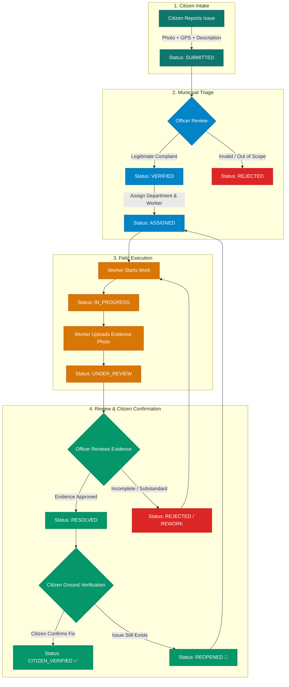
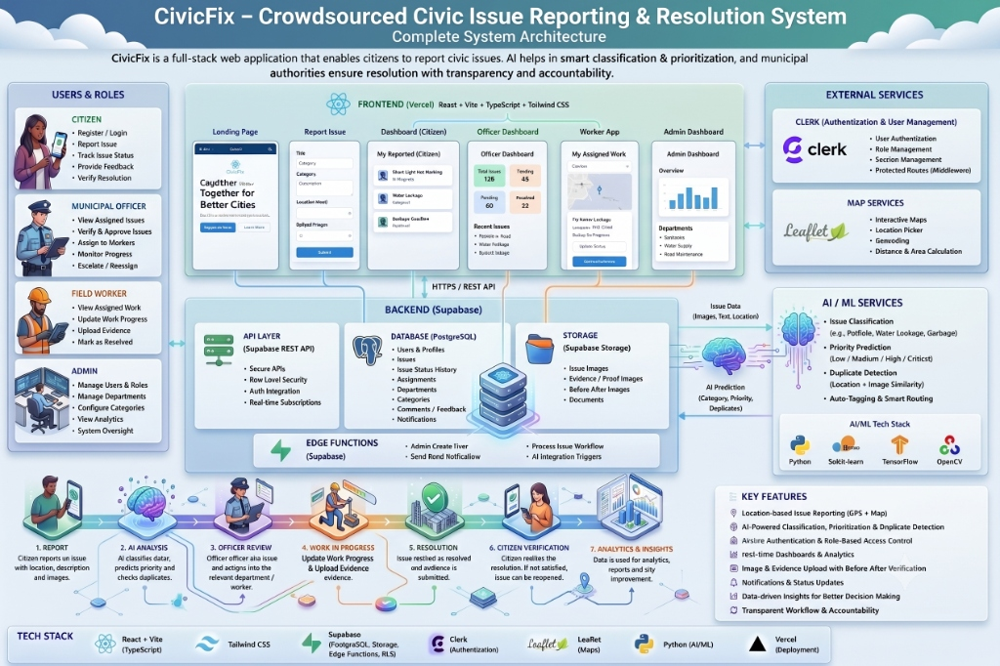

# 🌿 CivicFix

### Crowdsourced Civic Issue Reporting & Resolution System

> CivicFix connects citizens with municipal authorities to report civic problems, track their progress, verify resolutions, and build cleaner, safer, smarter communities.

[](https://civicfix-rho.vercel.app/)
[](https://react.dev/)
[](https://www.typescriptlang.org/)
[](https://vitejs.dev/)
[](https://tailwindcss.com/)
[](https://supabase.com/)
[](https://clerk.com/)

---

## 🌐 Live Application

| Environment | URL | Status |
| :--- | :--- | :--- |
| **Production Deployment** | **[https://civicfix-rho.vercel.app/](https://civicfix-rho.vercel.app/)** | 🟢 Operational |

---

## 📑 Table of Contents

- [Project Overview](#-project-overview)
- [Problem Statement](#-problem-statement)
- [The CivicFix Solution](#-the-civicfix-solution)
- [Key Features](#-key-features)
- [User Roles & Responsibilities](#-user-roles--responsibilities)
- [Complete Issue Lifecycle](#-complete-issue-lifecycle)
- [System Architecture](#-system-architecture)
- [Technology Stack](#-technology-stack)
- [Data Flow & Request Lifecycle](#-data-flow--request-lifecycle)
- [Project Directory Structure](#-project-directory-structure)
- [Authentication & Security Architecture](#-authentication--security-architecture)
- [Database Schema & Transition Rules](#-database-schema--transition-rules)
- [Admin Control Center](#-admin-control-center)
- [Local Development & Setup](#-local-development--setup)
- [Supabase Configuration](#-supabase-configuration)
- [Clerk Authentication Setup](#-clerk-authentication-setup)
- [Deployment Guide](#-deployment-guide)
- [How to Demo CivicFix](#-how-to-demo-civicfix)
- [Visual Walkthrough & Screenshots](#-visual-walkthrough--screenshots)
- [Current Implementation Status](#-current-implementation-status)
- [Future Roadmap](#-future-roadmap)
- [Engineering Challenges & Solutions](#-engineering-challenges--solutions)
- [Testing & Validation](#-testing--validation)
- [Contributing](#-contributing)
- [Team](#-team)
- [License](#-license)
- [Contact & Links](#-contact--links)

---

## 📖 Project Overview

Local civic infrastructure directly impacts daily urban life. Everyday problems like **potholes, garbage accumulation, broken streetlights, water supply leakage, and drainage blockages** frequently go unaddressed or take weeks to resolve.

### The Broken Feedback Loop

Traditional complaint systems suffer from a structural defect:
1. **Reporting** an issue does not guarantee municipal triage or field accountability.
2. An official status of **"Work Completed"** often fails to match **actual ground-level resolution**.

```text
Traditional Broken Loop:
[ Citizen Complaint ] ──> [ Lost in Bureaucracy ] ──> [ Marked Resolved on Paper ] ──> [ Problem Still on Ground ❌ ]
```

### How CivicFix Closes the Loop

CivicFix establishes a bi-directional, verifiable chain of custody where no complaint is closed until photographic proof is submitted and the reporting citizen verifies the outcome:

```text
Citizen Report (Photo + GPS)
            ↓
Municipal Officer Verification & Triage
            ↓
Department & Worker Assignment
            ↓
Field Worker Resolution & Photographic Evidence
            ↓
Municipal Officer Review & Approval
            ↓
Citizen Ground-Truth Verification
            ↓
Officially Resolved & Closed ✅ (or Reopened 🔄)
```

---

## ⚠️ Problem Statement

Urban governance systems face several systemic challenges:

- **Fragmented Complaint Intake**: Citizens lack a unified, accessible mobile-friendly interface to report local issues with verified geographic coordinates and photos.
- **Triage & Routing Bottlenecks**: Municipal staff face difficulties prioritizing complaints, assessing urgency, and routing work to the correct civic department.
- **Opaque Progress Tracking**: Complainants receive little or no real-time visibility into the status of their complaints after submission.
- **Lack of Verification & Proof**: Field work is often marked complete in administrative databases without verifiable evidence or confirmation from affected residents.
- **Recurring & Unresolved Failures**: When substandard repairs occur, citizens are forced to file entirely new complaints rather than reopening the original case history.

---

## 💡 The CivicFix Solution

CivicFix transforms municipal issue resolution into an open, auditable, and accountable digital pipeline:

- 📸 **Geo-Tagged Photographic Intake**: Complainants upload photos, descriptions, and capture browser GPS coordinates with a single tap.
- 🏛️ **Structured Municipal Triage**: Officers verify complaint legitimacy, assign priority levels (**Low, Medium, High, Urgent**), and route to relevant departments (**Sanitation, Water Supply, Road Maintenance, Traffic/Safety**, etc.).
- 👷 **Dedicated Field Worker Execution**: Field workers receive assigned tasks, change statuses to **In Progress**, perform ground repairs, and upload mandatory resolution photographs.
- 🛡️ **Double-Gate Resolution**: Work must first be reviewed and approved by a Municipal Officer, then verified by the citizen who submitted the original report.
- 🔄 **One-Click Reopen Capability**: If an issue was poorly addressed, the citizen can reopen the complaint with immediate status regression in the database.
- 📊 **Executive Analytics & Governance**: Administrators monitor citywide performance, resolution velocity, department workloads, and geographic concentration trends.

---

## 🌟 Key Features

### 📍 Smart Issue Reporting
- Capture issue title, description, category, and descriptive location.
- One-tap browser GPS coordinate capture with accuracy estimation.
- In-browser client-side image compression (JPEG scaling & quality optimization) to ensure swift uploads even on low-bandwidth mobile connections.
- Persistent local draft caching so citizens don't lose data during intake.

### 🗺️ Location & Contextual Tracking
- Exact latitude and longitude coordinate capture.
- One-click Google Maps redirection for navigation.
- Search and filter issues by locality, address, and department.

### 🏛️ Municipal Officer Operations
- Comprehensive issue triage queue with status, priority, and severity filtering.
- Review citizen reports and make **Verify** or **Reject** determinations.
- Department assignment (**Sanitation, Water Supply, Road Maintenance, Traffic/Safety**, etc.).
- Direct worker dispatch with real-time active worker roster lookups.

### 👷 Field Worker Workflow
- Personalized task dashboard displaying assigned repairs.
- Single-action progression: **Assigned** ➔ **In Progress** ➔ **Under Review**.
- In-field capture and upload of **Resolution Evidence Photos** directly stored in dedicated storage buckets.
- Full inspection of the original citizen complaint, GPS coordinates, and historical notes.

### 📸 Verifiable Resolution Evidence
- Side-by-side **Before & After** comparison display.
- Immutable storage of resolution photos linked to worker profiles and timestamps.
- Transparent access for both officers and citizens.

### 🔄 Multi-Stakeholder Status Audit History
- Detailed chronological timeline tracking every state change (`SUBMITTED` ➔ `VERIFIED` ➔ `ASSIGNED` ➔ `IN_PROGRESS` ➔ `UNDER_REVIEW` ➔ `RESOLVED` ➔ `CITIZEN_VERIFIED`).
- System-generated and officer-authored notes preserved for public and administrative transparency.

### ✅ Citizen Verification & Reopen Loop
- Interactive resolution confirmation modal for citizens once work is marked resolved.
- Citizens confirm (`VERIFIED`) or report failure (`UNRESOLVED`).
- Reopening automatically resets the issue back into the active municipal workflow.

### 👑 Admin Control Center & Analytics
- Live platform telemetry: total accounts, active issues, resolution rates, and department throughput.
- User management interface with role inspection, filtering, and role-reassignment capabilities.
- Secure server-side user provisioning for Municipal Officers and Field Workers.
- Interactive analytics dashboard featuring status distribution donut charts, monthly/weekly resolution trends, department response comparisons, and one-click **CSV data export**.

### 🤖 AI Integration — *Planned / Future Enhancement*
> ⚠️ **Note**: AI capabilities are designed in the architecture and modeled in the database schema (`issue_ai_analysis` table), but automated inference triggers are **planned for future milestones**.
>
> Planned AI capabilities include:
> - Automated category classification from citizen photos using vision models.
> - Intelligent severity and priority recommendation.
> - Computer-vision duplicate issue detection based on GPS proximity and image embeddings.
> - Automated routing to the most appropriate municipal department.

---

## 👥 User Roles & Responsibilities

| Role | Access Scope | Core Responsibilities |
| :--- | :--- | :--- |
| **Citizen** | `/app/citizen/*` | Report civic issues with photos and GPS, track personal issue history, review resolution photos, verify completed work, or reopen unresolved issues. |
| **Municipal Officer** | `/app/officer/*` | Review submitted reports, verify legitimacy, set severity/priority, route to departments, assign field workers, review resolution evidence, approve/reject work. |
| **Field Worker** | `/app/worker/*` | View assigned repair tasks, update operational state (`IN_PROGRESS`), perform physical repairs, upload photographic resolution evidence (`UNDER_REVIEW`). |
| **Admin** | `/app/admin/*` | Platform oversight, system analytics, user management, secure staff creation via Edge Functions, department administration, full issue catalog inspection. |

---

## 🔄 Complete Issue Lifecycle



### Verified Issue Status Enum (`issue_status`)

| Status | Description | Initiator |
| :--- | :--- | :--- |
| `SUBMITTED` | Issue newly reported by a citizen; awaiting municipal triage. | Citizen |
| `AI_ANALYZED` | Issue processed by analysis pipeline (DB state ready for ML integration). | System / ML |
| `VERIFIED` | Complaint validated by a Municipal Officer as legitimate. | Municipal Officer |
| `REJECTED` | Complaint deemed invalid, or resolution evidence rejected as insufficient. | Municipal Officer |
| `ASSIGNED` | Assigned to a specific municipal department and field worker. | Municipal Officer |
| `IN_PROGRESS` | Field worker has acknowledged the task and commenced physical work. | Field Worker |
| `UNDER_REVIEW` | Field worker has uploaded proof of completion and submitted for review. | Field Worker |
| `RESOLVED` | Municipal Officer has reviewed resolution photo and approved closure. | Municipal Officer |
| `CITIZEN_VERIFIED` | Reporting citizen has confirmed the physical issue is resolved. | Citizen |
| `REOPENED` | Citizen indicated the issue persists; sent back for re-assignment. | Citizen |

---

## 🏗️ System Architecture



### Architecture Component Breakdown

#### 1. Frontend Client (Vercel)
- **React 19 & TypeScript**: Component-driven SPA architecture with strong type safety.
- **Vite 8**: Optimized bundling with code-splitting across role routes.
- **Tailwind CSS v4 & Lucide Icons**: Modern, responsive UI with custom color hierarchies tailored for accessibility and field usability.
- **React Router DOM v7**: Client-side routing with role-based session guards (`RequireAuth`, `RequireRole`, `PublicOnly`).

#### 2. Authentication & Identity Layer (Clerk)
- **Clerk React SDK**: User sign-up, sign-in, session token lifecycle, and account management.
- **Clerk-to-Supabase Bridge**: Custom session synchronization hook (`useCivicFixProfileSync`) that exchanges Clerk JWTs for authenticated Supabase sessions and ensures local profile records exist in PostgreSQL.

#### 3. Backend & Database Platform (Supabase)
- **PostgreSQL**: Relational database with strict foreign keys, domain constraints, custom ENUM types, and audit triggers.
- **Row Level Security (RLS)**: Enforces multi-tenant data boundaries at the SQL level based on authenticated Clerk user IDs and role tables.
- **Supabase Storage**: Managed object storage buckets (`issue-images` and `resolution-images`) with authenticated upload and public read policies.
- **Database Functions & Triggers**: Automated role assignment on sign-up, atomic transition concurrency guards (`validate_issue_status_history_transition`), and synchronization triggers.

#### 4. Secure Edge Backend (Supabase Edge Functions)
- **Deno-based `admin-create-user` Function**: Handles privileged user creation (Municipal Officers and Field Workers) by authenticating admin credentials, invoking the Clerk Backend SDK (`@clerk/backend`), and writing matching database profiles within a transactional rollback block.

---

## 💻 Technology Stack

| Layer | Technology | Version / Tooling | Purpose |
| :--- | :--- | :--- | :--- |
| **Frontend Framework** | React | `^19.2.8` | Component-driven UI architecture |
| **Build & Dev Tool** | Vite | `^8.2.1` | Fast HMR and production bundle optimization |
| **Language** | TypeScript | `^6.0.3` | Static typing across components, models, and APIs |
| **Styling** | Tailwind CSS | `^4.3.3` | Utility-first responsive design and modern tokens |
| **Routing** | React Router DOM | `^7.18.2` | Client-side routing and protected route guards |
| **Icons & UI Primitives**| Lucide React / Radix Slot | `^1.31.0` / `^1.3.3` | Iconography and accessible UI component primitives |
| **Authentication** | Clerk | `@clerk/react ^6.14.4` | User identity, session tokens, and security |
| **Database & Platform**| Supabase / PostgreSQL | `@supabase/supabase-js ^2.112.3` | Relational storage, triggers, and RLS |
| **Storage** | Supabase Storage | S3-Compatible Buckets | High-durability citizen and worker image storage |
| **Serverless Backend** | Supabase Edge Functions | Deno Runtime | Privileged administrative operations & Clerk SDK |
| **Deployment** | Vercel | Production Cloud | Global edge CDN and SPA hosting |
| **Code Quality** | ESLint | `^10.8.1` | Static analysis and linting compliance |

---

## 🔁 Data Flow & Request Lifecycle

```text
Browser Client (React SPA on Vercel)
   │
   ├── [1. Authentication] ──> Clerk Auth Service (Issues Session JWT)
   │
   ├── [2. Authenticated Data API] ──> Supabase PostgreSQL
   │        │                              ├── Verified by RLS Policies (auth.jwt())
   │        │                              ├── Status Transition Constraints
   │        │                              └── Auto-audit Triggers
   │
   ├── [3. Image Uploads] ──> Supabase Storage Buckets
   │        ├── issue-images/ (Initial citizen evidence)
   │        └── resolution-images/ (Field worker repair evidence)
   │
   └── [4. Administrative Operations] ──> Supabase Edge Functions
            └── admin-create-user (Invokes Clerk Backend API + Supabase Admin)
```

---

## 📁 Project Directory Structure

```text
ConsoleLog/
├── docs/
│   └── architecture.png           # Complete system architecture diagram
├── public/                        # Static web assets
├── src/
│   ├── auth/                      # Authentication bridging & route guards
│   │   ├── app-session.tsx        # React context providing session & profile state
│   │   ├── clerk-supabase-bridge.tsx # Token bridging between Clerk and Supabase client
│   │   ├── route-guards.tsx       # RequireAuth, RequireRole, PublicOnly guards
│   │   └── use-civicfix-profile-sync.ts # Auto-syncs Clerk user to Supabase profile
│   ├── components/
│   │   ├── citizen/               # Citizen dashboard widgets & summary cards
│   │   ├── issues/                # Reusable issue image display component
│   │   ├── layout/                # AppLayout, AppNavbar, AppSidebar, BrandMark, etc.
│   │   └── ui/                    # Base UI buttons and design components
│   ├── lib/                       # Helpers, formatters, and Supabase client
│   │   ├── admin.ts               # Admin role formatters and status tones
│   │   ├── citizen-issues.ts      # Citizen data querying, image helpers & categories
│   │   ├── civicfix.ts            # Role configurations and navigation metadata
│   │   ├── officer-issues.ts      # Municipal officer triage & assignment helpers
│   │   ├── supabase.ts            # Typed Supabase client with dynamic JWT injection
│   │   ├── utils.ts               # Class merging utilities (clsx & tailwind-merge)
│   │   └── worker-issues.ts       # Worker task management & evidence formatting
│   ├── routes/                    # Application pages & routing definitions
│   │   ├── admin/                 # Admin Dashboard, Users, Issues, Analytics, Departments
│   │   ├── citizen/               # Citizen Dashboard, Report Issue, My Issues, Details
│   │   ├── officer/               # Officer Dashboard, Issue Triage, Details & Review
│   │   ├── worker/                # Worker Dashboard, Assigned Issues, Evidence Upload
│   │   ├── home.tsx               # Public landing page
│   │   ├── index.tsx              # Application router configuration
│   │   ├── login.tsx              # Clerk sign-in interface
│   │   ├── signup.tsx             # Clerk sign-up interface
│   │   ├── onboarding.tsx         # New user onboarding view
│   │   ├── role-selection.tsx     # Role-aware routing & redirection
│   │   └── unauthorized.tsx       # Role mismatch fallback page
│   ├── types/
│   │   └── database.ts            # Comprehensive TypeScript definitions for Supabase schema
│   ├── App.tsx                    # Root application component
│   ├── index.css                  # Global Tailwind CSS styles and custom design system
│   └── main.tsx                   # App entrypoint with ClerkProvider
├── supabase/
│   ├── functions/
│   │   └── admin-create-user/     # Secure Deno Edge Function for staff provisioning
│   ├── migrations/                # Version-controlled SQL migrations
│   │   ├── 0001_civicfix_schema.sql
│   │   ├── 0002_civicfix_rls.sql
│   │   ├── 0003_civicfix_privileged_role_protection.sql
│   │   ├── 0004_civicfix_issue_image_storage_policies.sql
│   │   ├── 0005_civicfix_issue_images_bucket.sql
│   │   ├── 0006_civicfix_citizen_verification_status_sync.sql
│   │   ├── 0007_civicfix_officer_profile_read_scope.sql
│   │   ├── 0008_civicfix_worker_workflow_access.sql
│   │   ├── 0009_civicfix_resolution_images_bucket.sql
│   │   ├── 0010_civicfix_worker_resolution_review_state.sql
│   │   ├── 0011_civicfix_worker_under_review_sync.sql
│   │   ├── 0012_civicfix_issue_status_transition_guard.sql
│   │   ├── 0013_civicfix_reopen_clears_citizen_verification.sql
│   │   └── 0014_civicfix_transition_concurrency_guards.sql
│   └── seed.sql                   # Seed data for roles and departments
├── vercel.json                    # Single Page App rewrite rules for Vercel
├── package.json                   # Dependencies and npm scripts
├── tsconfig.json                  # TypeScript compiler settings
└── vite.config.ts                 # Vite bundler configuration
```

---

## 🔒 Authentication & Security Architecture

CivicFix uses an enterprise-grade authentication and authorization model:

1. **Identity Provider**: Clerk handles user credentials, multi-factor authentication, email verification, and session token generation.
2. **Third-Party Supabase Auth Integration**: Supabase verifies incoming Clerk JWT session tokens using the configured Clerk issuer domain.
3. **Row-Level Security (RLS)**:
   - Database queries leverage helper functions (`requesting_clerk_user_id()`, `current_profile_id()`, and `current_user_has_role()`) to restrict row access directly at the PostgreSQL layer.
   - Citizens can only query their own submitted issues or public summary views.
   - Field Workers can only view issues actively assigned to their profile.
   - Municipal Officers and Admins have broad access to triage and oversee issues across departments.
4. **Client-Side Safety**: No secret keys (`CLERK_SECRET_KEY`, `SUPABASE_SERVICE_ROLE_KEY`) are ever bundled in frontend code or exposed in browser bundles.
5. **Secure Administrative Provisioning**: Creation of Municipal Officer and Field Worker credentials is exclusively executed inside the isolated `admin-create-user` Edge Function.

---

## 🗄️ Database Schema & Transition Rules

### Key PostgreSQL Tables

```text
┌────────────────────────┐      ┌────────────────────────┐      ┌────────────────────────┐
│         roles          │      │      departments       │      │        profiles        │
├────────────────────────┤      ├────────────────────────┤      ├────────────────────────┤
│ id (PK, UUID)          │      │ id (PK, UUID)          │      │ id (PK, UUID)          │
│ code (role_code ENUM)  │      │ name (TEXT, UNIQUE)    │      │ clerk_user_id (UNIQUE) │
│ name (TEXT, UNIQUE)    │      │ description (TEXT)     │      │ full_name (TEXT)       │
│ description (TEXT)     │      │ is_active (BOOLEAN)    │      │ email (TEXT, UNIQUE)   │
└───────────┬────────────┘      └───────────┬────────────┘      │ role_id (FK -> roles)  │
            │                               │                   │ department_id (FK)     │
            └───────────────────────────────┼───────────────────┴───────────┬────────────┘
                                            │                               │
                                            ▼                               ▼
                                ┌────────────────────────────────────────────────────────┐
                                │                         issues                         │
                                ├────────────────────────────────────────────────────────┤
                                │ id (PK, UUID)                                          │
                                │ reporter_profile_id (FK -> profiles)                   │
                                │ title, description, category (TEXT)                    │
                                │ severity (issue_severity ENUM)                         │
                                │ priority (issue_priority ENUM)                         │
                                │ status (issue_status ENUM)                             │
                                │ latitude, longitude (NUMERIC(9,6))                     │
                                │ location_text, address_text (TEXT)                     │
                                │ department_id (FK -> departments)                      │
                                │ resolved_at (TIMESTAMPTZ)                              │
                                └───────────────────────────┬────────────────────────────┘
                                                            │
         ┌──────────────────────────────┬───────────────────┼────────────────────────────┐
         ▼                              ▼                   ▼                            ▼
┌────────────────────────┐   ┌────────────────────────┐   ┌────────────────────────┐   ┌────────────────────────┐
│      issue_images      │   │   issue_assignments    │   │  issue_status_history  │   │resolution_verifications│
├────────────────────────┤   ├────────────────────────┤   ├────────────────────────┤   ├────────────────────────┤
│ id (PK, UUID)          │   │ id (PK, UUID)          │   │ id (PK, UUID)          │   │ id (PK, UUID)          │
│ issue_id (FK -> issues)│   │ issue_id (FK -> issues)│   │ issue_id (FK -> issues)│   │ issue_id (FK -> issues)│
│ storage_bucket (TEXT)  │   │ department_id (FK)     │   │ old_status (ENUM)      │   │ citizen_id (FK)        │
│ storage_path (TEXT)    │   │ worker_id (FK)         │   │ new_status (ENUM)      │   │ result (ENUM)          │
│ image_type (ENUM)      │   │ status (ENUM)          │   │ changed_by (FK)        │   │ feedback (TEXT)        │
└────────────────────────┘   └────────────────────────┘   └────────────────────────┘   └────────────────────────┘
```

### Database Transition Guards & Concurrency Safety

Migration `0014_civicfix_transition_concurrency_guards.sql` enforces strict state validation with `FOR UPDATE` row locks:

- **Municipal Officers / Admins**:
  - `SUBMITTED` / `AI_ANALYZED` ➔ `VERIFIED`
  - `VERIFIED` / `REOPENED` ➔ `ASSIGNED`
  - `UNDER_REVIEW` ➔ `RESOLVED` or `REJECTED`
- **Field Workers**:
  - `ASSIGNED` / `REOPENED` / `REJECTED` ➔ `IN_PROGRESS` (only for assigned worker)
  - `IN_PROGRESS` ➔ `UNDER_REVIEW` (triggers review notice and links resolution photo)
- **Citizens**:
  - `RESOLVED` ➔ `CITIZEN_VERIFIED` or `REOPENED` (only for original reporter)

---

## 🛠️ Admin Control Center

The Admin Control Center (`/app/admin`) provides full municipal oversight:

1. **System Overview**: High-level counters for total users, open complaints, resolved cases, and active departments.
2. **User Administration**:
   - Filter all accounts by role (`CITIZEN`, `MUNICIPAL_OFFICER`, `FIELD_WORKER`, `ADMIN`) or department.
   - Search accounts by name, email, or telephone.
   - Provision staff accounts through a modal invoking the serverless Edge Function.
3. **Department Management**:
   - Create, inspect, activate, or deactivate municipal service divisions.
4. **Platform Analytics**:
   - Dynamic SVG Donut Chart breakdown of issue statuses.
   - Time-series charts tracking intake vs. resolution trends across 7-day, 30-day, 3-month, 6-month, and 1-year windows.
   - Department throughput comparisons (assigned, pending, resolved, reopened, average turnaround hours).
   - One-click **Export to CSV** for offline administrative reporting.

---

## 💻 Local Development & Setup

### Prerequisites

- **Node.js**: v18.0.0 or later (Node 20+ recommended)
- **npm**: v9.0.0 or later
- **Git**: Installed and configured

### 1. Clone the Repository

```bash
git clone https://github.com/Prashant952024/ConsoleLog.git
cd ConsoleLog
```

### 2. Install Dependencies

```bash
npm install
```

### 3. Configure Environment Variables

Create a `.env` file in the project root:

```bash
cp .env.example .env
```

Populate the required environment variables:

```env
# Supabase Configuration
VITE_SUPABASE_URL=https://your-project-id.supabase.co
VITE_SUPABASE_PUBLISHABLE_KEY=your-supabase-anon-or-publishable-key

# Clerk Authentication Configuration
VITE_CLERK_PUBLISHABLE_KEY=pk_test_your_clerk_publishable_key
```

> 🔒 **Security Notice**: Never commit `.env` or paste secret service keys (`SUPABASE_SERVICE_ROLE_KEY` or `CLERK_SECRET_KEY`) in frontend files.

### 4. Start the Development Server

```bash
npm run dev
```

The application will be accessible at `http://localhost:5173`.

---

## 🐘 Supabase Configuration

### 1. Database Migrations

Apply the migration scripts located in `supabase/migrations/` sequentially in your Supabase SQL Editor or using the Supabase CLI:

```bash
supabase db push
```

Or execute the scripts in order:
1. `0001_civicfix_schema.sql` — Base tables, enums, indexes, triggers
2. `0002_civicfix_rls.sql` — Row Level Security policies
3. `0003_civicfix_privileged_role_protection.sql` — Role protection rules
4. `0004_civicfix_issue_image_storage_policies.sql` — Storage RLS
5. `0005_civicfix_issue_images_bucket.sql` — Storage bucket creation
6. `0006_civicfix_citizen_verification_status_sync.sql` — Citizen verification synchronization
7. `0007_civicfix_officer_profile_read_scope.sql` — Officer profile scope
8. `0008_civicfix_worker_workflow_access.sql` — Field worker permissions
9. `0009_civicfix_resolution_images_bucket.sql` — Resolution images bucket
10. `0010_civicfix_worker_resolution_review_state.sql` — Review state handling
11. `0011_civicfix_worker_under_review_sync.sql` — Worker state sync
12. `0012_civicfix_issue_status_transition_guard.sql` — Transition enforcement
13. `0013_civicfix_reopen_clears_citizen_verification.sql` — Reopen cleanup
14. `0014_civicfix_transition_concurrency_guards.sql` — Concurrency locking

Seed baseline roles and departments using `supabase/seed.sql`.

### 2. Storage Buckets

Verify that the following public storage buckets exist in Supabase Storage:
- `issue-images` (For citizen intake photos)
- `resolution-images` (For field worker completion proof)

### 3. Deploying the Edge Function (For Admin Staff Creation)

```bash
supabase functions deploy admin-create-user
```

Set the required environment secrets in Supabase:

```bash
supabase secrets set SUPABASE_URL=https://your-project-id.supabase.co
supabase secrets set SUPABASE_SERVICE_ROLE_KEY=your-service-role-key
supabase secrets set CLERK_SECRET_KEY=sk_test_your_clerk_secret_key
supabase secrets set CLERK_PUBLISHABLE_KEY=pk_test_your_clerk_publishable_key
supabase secrets set CIVICFIX_ALLOWED_ORIGINS=https://civicfix-rho.vercel.app,http://localhost:5173
```

---

## 🔑 Clerk Authentication Setup

1. Create an application in the [Clerk Dashboard](https://dashboard.clerk.com/).
2. Under **Configure ➔ JWT Templates**, add a new **Supabase** template (or configure Clerk as a Third-Party Auth Provider in Supabase Auth settings by providing your Clerk Frontend API URL).
3. Copy your **Publishable Key** into `VITE_CLERK_PUBLISHABLE_KEY`.
4. In the Clerk Dashboard, configure the allowed redirect URLs:
   - Development: `http://localhost:5173`
   - Production: `https://civicfix-rho.vercel.app`

---

## 🚀 Deployment Guide

### Deploying to Vercel

CivicFix is pre-configured for Vercel deployment with client-side SPA routing via `vercel.json`:

```json
{
  "rewrites": [
    {
      "source": "/(.*)",
      "destination": "/index.html"
    }
  ]
}
```

#### Build Settings
- **Framework Preset**: Vite
- **Build Command**: `npm run build` (`tsc -b && vite build`)
- **Output Directory**: `dist`

#### Environment Variables in Vercel
Add the following in your Vercel Project Settings:
- `VITE_SUPABASE_URL`
- `VITE_SUPABASE_PUBLISHABLE_KEY`
- `VITE_CLERK_PUBLISHABLE_KEY`

---

## 🎬 How to Demo CivicFix

Follow this end-to-end walkthrough to evaluate the complete CivicFix lifecycle:

```text
Step 1: Sign up / Sign in as a Citizen
        ➔ Go to https://civicfix-rho.vercel.app/
        ➔ Click "Report an Issue" and register/sign in.

Step 2: Submit a Civic Complaint
        ➔ Navigate to "/app/citizen/report".
        ➔ Enter a title (e.g., "Deep pothole near Metro Station Gate 2").
        ➔ Select category ("Pothole"), add description, capture GPS location, attach a photo.
        ➔ Submit the report and view the confirmation receipt.

Step 3: Officer Triage & Assignment
        ➔ Sign in with a Municipal Officer account.
        ➔ Open "/app/officer/issues" and find the newly submitted complaint.
        ➔ Click the issue to view details.
        ➔ Click "Verify Complaint" (Status becomes VERIFIED).
        ➔ Set priority to "High" and assign a Department and Field Worker.

Step 4: Field Worker Resolution
        ➔ Sign in with the assigned Field Worker account.
        ➔ Open "/app/worker/assigned-issues".
        ➔ Click the issue and press "Start Work" (Status becomes IN_PROGRESS).
        ➔ Upload a completion photo and click "Submit Resolution" (Status becomes UNDER_REVIEW).

Step 5: Officer Review & Approval
        ➔ Switch back to the Municipal Officer account.
        ➔ Open the issue in "/app/officer/issues".
        ➔ Review the uploaded before/after evidence and click "Approve Resolution" (Status becomes RESOLVED).

Step 6: Citizen Verification & Closure
        ➔ Switch back to the Citizen account.
        ➔ Open "/app/citizen/issues" and click the resolved issue.
        ➔ Review the "Before" and "After" proof.
        ➔ Click "Yes, Issue Resolved" (Status becomes CITIZEN_VERIFIED ✅).
        ➔ Alternatively, test the reopen loop by selecting "No, Issue Still Exists" and clicking "Reopen Complaint" (Status resets to REOPENED 🔄).

Step 7: Admin Oversight & Analytics
        ➔ Sign in with an Admin account.
        ➔ Navigate to "/app/admin/analytics" to view the updated status donut, throughput charts, and export data via CSV.
        ➔ Visit "/app/admin/users" to test staff creation and role updates.
```

---

## 📸 Visual Walkthrough & Screenshots

| Section | Description |
| :--- | :--- |
| **Landing Page** | Responsive presentation showcasing the 5-step workflow, trust metrics, role benefits, and call-to-action buttons. |
| **Citizen Intake** | Mobile-optimized reporting form with image compression, GPS coordinate capture, and instant submission receipt. |
| **Citizen Details & Verification** | Timeline view of status transitions, before/after evidence comparison, and interactive verification buttons. |
| **Officer Triage Dashboard** | Queue management with category, priority, and status filtering, verification actions, and worker dispatch. |
| **Worker Task Center** | Dedicated field interface with work step tracker (`Assigned` ➔ `In Progress` ➔ `Under Review`) and evidence uploader. |
| **Admin Analytics Hub** | Live platform intelligence with dynamic SVG donut chart, resolution velocity, department comparisons, and CSV export. |

---

## ✅ Current Implementation Status

| Feature Area | Implementation Status | Notes |
| :--- | :---: | :--- |
| **Authentication & Profile Synchronization** | 🟢 Live | Clerk auth bridged to Supabase PostgreSQL profiles |
| **Citizen Issue Reporting (Photo + GPS)** | 🟢 Live | Client-side image compression & browser geolocation |
| **Role-Based Access Control (4 Roles)** | 🟢 Live | Citizen, Municipal Officer, Field Worker, Admin |
| **Officer Verification & Assignment** | 🟢 Live | Triage workflow with department and worker routing |
| **Worker Resolution & Evidence Upload** | 🟢 Live | Evidence photo upload to `resolution-images` bucket |
| **Officer Evidence Review (Approve/Reject)** | 🟢 Live | Multi-tier review before final resolution |
| **Citizen Verification & Reopen Workflow** | 🟢 Live | Ground-truth verification & automatic status regression |
| **Admin User & Department Management** | 🟢 Live | Filter accounts, reassign roles, toggle departments |
| **Serverless Staff Provisioning** | 🟢 Live | Edge Function `admin-create-user` via Clerk SDK |
| **Interactive Analytics & CSV Export** | 🟢 Live | SVG charts, time-series, department velocity, data export |
| **Production Cloud Deployment** | 🟢 Live | Deployed on Vercel with SPA rewrite rules |

---

## 🗺️ Future Roadmap

The following features represent planned enhancements for future iterations of CivicFix:

- [ ] **AI-Powered Visual Classification**: Deep learning integration to automatically detect issue categories (potholes, garbage, streetlights) from citizen photos upon upload.
- [ ] **Automated Urgency & Severity Scoring**: NLP analysis of issue descriptions combined with image assessment to recommend priority scores.
- [ ] **Computer Vision Duplicate Detection**: Proximity-based and perceptual hash matching to flag duplicate complaint submissions in the same vicinity.
- [ ] **Geospatial Heatmap View**: Interactive Mapbox / Leaflet citywide heatmap displaying live issue density and resolution hotspots.
- [ ] **Citizen Push & SMS Notifications**: Web push, WhatsApp, and SMS alerts on status updates and resolution ready for verification.
- [ ] **Native Mobile Application**: React Native / Expo mobile app with offline storage and background geolocation tracking for field workers.
- [ ] **Municipal ERP & Smart City Integrations**: REST webhooks and OpenAPI connectors for integration with municipal government grievance redressal systems.

---

## 💡 Engineering Challenges & Solutions

### 1. Concurrency & Race Conditions in Status Transitions
- **Challenge**: Multiple users or rapid double-clicking could trigger duplicate transitions or bypass intermediate states.
- **Solution**: Implemented PostgreSQL transaction-level row locking (`FOR UPDATE`) inside `validate_issue_status_history_transition()` alongside UI submission guards and unique indexes (`issue_assignments_one_active_per_issue_idx`).

### 2. High-Resolution Mobile Image Upload Latency
- **Challenge**: Large smartphone camera photos (8–15 MB) cause slow uploads and high bandwidth consumption in the field.
- **Solution**: Built an in-browser canvas-based image compression utility (`compressIssueImage` / `compressResolutionImage`) that dynamically scales photos down to standard HD dimensions and 82% JPEG quality before initiating multipart uploads.

### 3. Resolution Authenticity & Verification Gaps
- **Challenge**: Field staff marking complaints resolved without completing ground repairs.
- **Solution**: Implemented a mandatory two-tier verification mechanism: workers must attach resolution photos to enter `UNDER_REVIEW`, officers must approve the evidence for `RESOLVED`, and citizens have ultimate veto authority via `CITIZEN_VERIFIED` or `REOPENED`.

### 4. Zero Secret Key Leakage in Client Bundles
- **Challenge**: Securely creating Municipal Officer and Field Worker credentials without embedding Clerk secret keys or Supabase service role keys in client code.
- **Solution**: Delegated administrative creation to an isolated Deno-based Supabase Edge Function that verifies the calling user's admin role and invokes the Clerk Backend API server-side.

---

## 🧪 Testing & Validation

### Codebase Validation Commands

```bash
# Run ESLint across all TypeScript and React files
npm run lint

# Execute TypeScript typechecking and production build compilation
npm run build
```

---

## 🤝 Contributing

Contributions to CivicFix are welcome. Please adhere to the standard fork-and-pull workflow:

1. **Fork** the repository.
2. **Create a feature branch**:
   ```bash
   git checkout -b feature/your-feature-name
   ```
3. **Commit your changes**:
   ```bash
   git commit -m "feat: describe your change"
   ```
4. **Validate formatting and build**:
   ```bash
   npm run lint
   npm run build
   ```
5. **Push to your branch**:
   ```bash
   git push origin feature/your-feature-name
   ```
6. **Open a Pull Request** with a detailed explanation of your changes.

---

## 👥 Team

| Name | Role | Primary Contribution |
| :--- | :--- | :--- |
| **Prashant Kumar** | Project Lead & Full-Stack Developer | System Architecture, Frontend Development, Supabase Migrations, Auth Integration & Deployment |

---

## 📄 License

> License information to be added.

---

## 📬 Contact & Links

- **Live Application**: [https://civicfix-rho.vercel.app/](https://civicfix-rho.vercel.app/)
- **GitHub Repository**: [https://github.com/Prashant952024/ConsoleLog](https://github.com/Prashant952024/ConsoleLog)
- **Project Documentation**: [docs/architecture.png](docs/architecture.png)

---

<div align="center">
  <sub>Built with ❤️ for cleaner, safer, and smarter communities.</sub>
</div>

