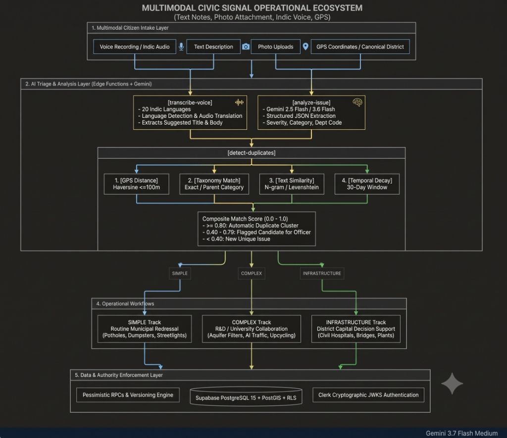
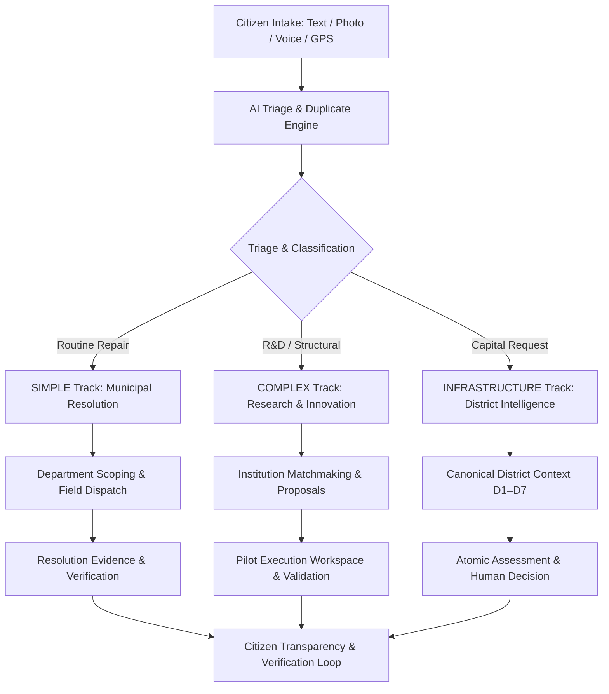
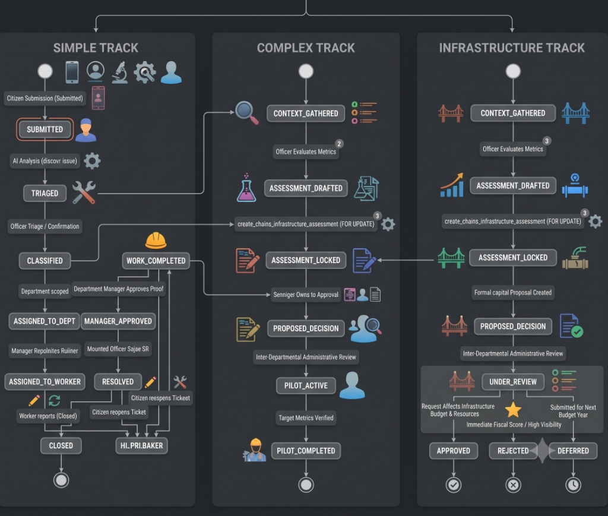
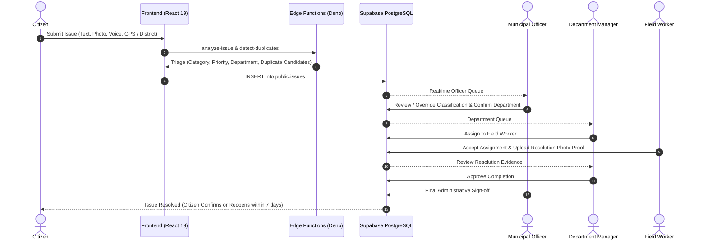
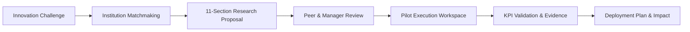

# CivicFix

> **AI-assisted civic issue resolution, infrastructure intelligence, and innovation collaboration platform.**

CivicFix is a modern full-stack platform designed to bridge the operational gap between citizens, municipal field administration, research institutions, and urban planning authorities. By combining multimodal citizen intake (text, images, voice, GPS) with automated Google Gemini AI triage, canonical geospatial registry mapping, and deterministic database state machines, CivicFix provides end-to-end operational workflows for routine maintenance, long-term research partnerships, and capital infrastructure decision support.

---

[](https://react.dev/)
[](https://www.typescriptlang.org/)
[](https://vitejs.dev/)
[](https://tailwindcss.com/)
[](https://clerk.com/)
[](https://supabase.com/)
[](https://ai.google.dev/)
[](https://vercel.com/)

---

## Important Governance Principle

> [!IMPORTANT]
> **CivicFix is a decision-support and operational execution platform.**
>
> Artificial Intelligence and automated heuristics compute evidence, triage classifications, candidate duplicate matches, institution recommendations, feasibility indicators, and baseline district analytics.
>
> **AI models do not possess administrative authority and do not make final government or fiscal decisions.**
>
> All classification overrides, work order dispatches, research grant approvals, and capital infrastructure allocations require human review and explicit authorization by designated municipal officers, department managers, innovation managers, or administrators.
>
> For infrastructure decisions, the system enforces a strict four-stage pipeline:
> $$\text{System-Generated Evidence (D1–D7)} \longrightarrow \text{Versioned Assessment} \longrightarrow \text{Authorized Human Review} \longrightarrow \text{Final Administrative Decision}$$

---

## Table of Contents

1. [The Problem](#1-the-problem)
2. [The CivicFix Idea](#2-the-civicfix-idea)
3. [Three-Track Architecture](#3-three-track-architecture)
4. [Simple Civic Issue Workflow](#4-simple-civic-issue-workflow)
5. [AI Capabilities](#5-ai-capabilities)
6. [Infrastructure Intelligence](#6-infrastructure-intelligence)
7. [Planning Sectors](#7-planning-sectors)
8. [D1–D8 Data Architecture](#8-d1d8-data-architecture)
9. [District Context Engine](#9-district-context-engine)
10. [Infrastructure Assessment & Decision Architecture](#10-infrastructure-assessment--decision-architecture)
11. [Complex Innovation Ecosystem](#11-complex-innovation-ecosystem)
12. [User Roles & Permissions](#12-user-roles--permissions)
13. [Authentication & Authorization](#13-authentication--authorization)
14. [Security Architecture](#14-security-architecture)
15. [Security Hardening & Engineering History](#15-security-hardening--engineering-history)
16. [Scalability & Concurrency Model](#16-scalability--concurrency-model)
17. [Performance Benchmarks](#17-performance-benchmarks)
18. [Database Schema & Architecture](#18-database-schema--architecture)
19. [Edge Functions Reference](#19-edge-functions-reference)
20. [Frontend Architecture](#20-frontend-architecture)
21. [Internationalization (i18n) & Voice](#21-internationalization-i18n--voice)
22. [Project Directory Structure](#22-project-directory-structure)
23. [Testing & Quality Assurance](#23-testing--quality-assurance)
24. [Local Development Setup](#24-local-development-setup)
25. [Database Setup & Migrations](#25-database-setup--migrations)
26. [Dataset Setup](#26-dataset-setup)
27. [Running the Application](#27-running-the-application)
28. [Deployment Architecture](#28-deployment-architecture)
29. [Responsible Use & System Limitations](#29-responsible-use--system-limitations)
30. [Future Scope](#30-future-scope)
31. [Demo Walkthrough](#31-demo-walkthrough)
32. [Project Status](#32-project-status)
33. [License & Contributing](#33-license--contributing)

---

## 1. The Problem

Modern civic governance faces systemic structural bottlenecks across municipal administration:

- **Fragmented Citizen Intake**: Grievances arrive across unstructured phone lines, social media, and paper forms with vague locations and no verifiable multimedia evidence.
- **Workflow Mismatch**: Municipal portals treat a broken streetlight identically to a chronic regional aquifer contamination or a multi-crore flyover demand, causing high-complexity systemic problems to stagnate in routine repair queues.
- **Duplicate Noise & Field Inefficiency**: Multiple citizens independently report the same pothole or burst pipe, inundating field engineers with redundant tickets while obscuring unique issues.
- **Unverified Resolutions**: Field workers close tickets without tamper-evident photo proof or GPS verification, leading to citizen distrust and recurring complaints.
- **Isolated Research Institutions**: Engineering colleges and university research labs develop viable municipal solutions, but lack direct collaboration pipelines with city administrations.
- **Planning in the Dark**: Capital budget allocations and infrastructure grants are frequently decided without unified baseline metrics on district demographics, existing asset density, accessibility scores, or historical project delivery.

---

## 2. The CivicFix Idea

CivicFix introduces a unified multi-track operational ecosystem that ingests multimodal civic signals, performs AI-assisted triage and duplicate cluster detection, and routes every request into its appropriate administrative lifecycle:

<div align="center">
  
</div>

### Operational Ecosystem Layers:
1. **Multimodal Citizen Intake Layer**: Captures voice recordings across Indic languages, natural language text descriptions, camera photo attachments, and GPS coordinates or canonical district selections.
2. **AI Triage & Analysis Layer (Edge Functions + Gemini)**:
   - `[transcribe-voice]`: Speech-to-text transcription across 20 Indic languages with automated English translation, suggested titles, and bodies.
   - `[analyze-issue]`: Gemini 2.5 Flash / 3.6 Flash multimodal inference extracting structured category, severity, priority, department code, and workflow complexity.
   - `[detect-duplicates]`: 4-factor scoring heuristic evaluating GPS spatial proximity ($\le 100\text{m}$), category congruence, n-gram/Levenshtein text similarity, and 30-day temporal decay. Scores $\ge 0.80$ trigger automatic duplicate clustering; $0.40 - 0.79$ flag candidate duplicates for officer review.
3. **Deterministic Track Branching**: Classifies issues into **`SIMPLE`**, **`COMPLEX`**, or **`INFRASTRUCTURE`** tracks.
4. **Operational Workflows**:
   - `SIMPLE Track`: Routine municipal redressal (potholes, dumpsters, streetlights).
   - `COMPLEX Track`: R&D and university collaboration (aquifer filters, AI traffic, upcycling).
   - `INFRASTRUCTURE Track`: District capital decision support (civil hospitals, bridges, plants).
5. **Data & Authority Enforcement Layer**: Underpinned by Supabase PostgreSQL 15 + PostGIS + RLS, Clerk cryptographic JWKS authentication, and pessimistic stored procedures (`FOR UPDATE`) with monotonic versioning.


```mermaid
flowchart TD
    A[Citizen Intake: Text / Photo / Voice / GPS] --> B[AI Triage & Duplicate Engine]
    B --> C{Triage & Classification}

    C -->|Routine Repair| D[SIMPLE Track: Municipal Resolution]
    C -->|R&D / Structural| E[COMPLEX Track: Research & Innovation]
    C -->|Capital Request| F[INFRASTRUCTURE Track: District Intelligence]

    D --> G[Department Scoping & Field Dispatch]
    G --> H[Resolution Evidence & Verification]

    E --> I[Institution Matchmaking & Proposals]
    I --> J[Pilot Execution Workspace & Validation]

    F --> K[Canonical District Context D1–D7]
    K --> L[Atomic Assessment & Human Decision]

    H --> M[Citizen Transparency & Verification Loop]
    J --> M
    L --> M
```

---

## 3. Three-Track Architecture

CivicFix segregates civic management into three distinct operational tracks based on problem complexity, governance requirements, and capital investment scale:

<div align="center">
  
</div>

| Track | Purpose | Typical Example | Workflow Structure | Key Participants |
| :--- | :--- | :--- | :--- | :--- |
| **`SIMPLE`** | Rapid municipal grievance redressal and physical repairs. | Pothole, overflowing garbage dumpster, broken street lamp, water main leak. | Intake $\to$ Triage $\to$ Assignment $\to$ Field Execution $\to$ Photo Proof $\to$ Citizen Verification. | Citizen, Municipal Officer, Department Manager, Field Worker. |
| **`COMPLEX`** | Academic, scientific, and industry collaboration for chronic problems requiring research, prototypes, or private investment. | Low-cost water filtration for arsenic belts, AI traffic signal optimization, plastic waste upcycling. | Challenge Generation $\to$ Institution Match $\to$ 11-Section Proposal $\to$ Pilot Workspace $\to$ KPI Validation $\to$ Deployment Plan. | Citizen, Innovation Manager, University / R&D Institution, Industry Partner. |
| **`INFRASTRUCTURE`** | Data-backed capital investment and district-scale infrastructure decision support. | New district civil hospital, rural bridge connection, solid waste processing facility. | District Mapping $\to$ Planning Sector Scoping $\to$ Multi-Dataset Aggregation (D1–D7) $\to$ Atomic Assessment $\to$ Administrative Review. | Citizen, Municipal Officer, Department Manager, Platform Admin. |

---

## 4. Simple Civic Issue Workflow


```mermaid
sequenceDiagram
    autonumber
    actor Citizen
    participant Client as Frontend (React 19)
    participant Edge as Edge Functions (Deno)
    participant DB as Supabase PostgreSQL
    actor Officer as Municipal Officer
    actor Manager as Department Manager
    actor Worker as Field Worker

    Citizen->>Client: Submit Issue (Text, Photo, Voice, GPS / District)
    Client->>Edge: analyze-issue & detect-duplicates
    Edge-->>Client: Triage (Category, Priority, Department, Duplicate Candidates)
    Client->>DB: INSERT into public.issues
    DB-->>Officer: Realtime Officer Queue
    Officer->>DB: Review / Override Classification & Confirm Department
    DB-->>Manager: Department Queue
    Manager->>DB: Assign to Field Worker
    Worker->>DB: Accept Assignment & Upload Resolution Photo Proof
    DB-->>Manager: Review Resolution Evidence
    Manager->>DB: Approve Completion
    Officer->>DB: Final Administrative Sign-off
    DB-->>Citizen: Issue Resolved (Citizen Confirms or Reopens within 7 days)
```

### Intake Stages:
1. **Multimodal Input**: Captures textual descriptions, camera photos, GPS coordinates (or manual district selection), and audio voice recordings.
2. **AI Triage**: Google Gemini generates structured JSON assigning category, severity, priority, primary department, complexity classification, and diagnostic reasoning.
3. **Composite Duplicate Detection**: Evaluates spatial, textual, categorical, and temporal signals before database insertion.
4. **Department Assignment**: Issues route to department queues governed by PostgreSQL Row Level Security (RLS).
5. **Field Execution & Evidence**: Assigned field workers submit photographic evidence and resolution notes.
6. **Two-Tier Administrative Review**: Department managers approve field submissions; municipal officers grant final sign-off.
7. **Citizen Verification**: Citizens review the resolution evidence and either confirm resolution or reopen the ticket.

---

## 5. AI Capabilities

### Multimodal Issue Analysis (`analyze-issue`)
- Analyzes natural language descriptions and uploaded images using structured Gemini generation.
- Returns schema-validated JSON with:
  - `category`: Municipal taxonomy (e.g. `ROADS_AND_FOOTPATHS`, `WATER_SUPPLY`, `SOLID_WASTE`).
  - `severity`: `LOW`, `MEDIUM`, `HIGH`, `CRITICAL`.
  - `priority`: Operational priority `1` (Highest) to `5` (Lowest).
  - `department_code`: Target municipal department.
  - `complexity`: Workflow classification (`SIMPLE` vs. `COMPLEX`).
  - `confidence_score`: Statistical model confidence (0.00 to 1.00).
  - `explanation`: Explainable summary of findings.

### Multilingual Indic Voice Transcription (`transcribe-voice`)
- Transcribes and translates field audio recordings in real time.
- Supports 20 Indic languages (including Hindi, Marathi, Bengali, Tamil, Telugu, Gujarati, Punjabi, Kannada, Odia, Urdu, and Sanskrit) alongside English.
- Formats transcripts into structured title and description fields with automatic language identification.

### Composite Duplicate Detection (`detect-duplicates`)
Evaluates candidate duplicate issues using a deterministic 4-factor scoring heuristic:
1. **GPS Spatial Proximity**: Haversine distance formula with maximum score within a 100-meter radius.
2. **Category Congruence**: Exact taxonomy matching against municipal classification trees.
3. **Textual Similarity**: Token-level n-gram and Levenshtein string distance across titles and descriptions.
4. **Temporal Proximity**: Exponential time-decay score evaluated over an active 30-day historical window.

### Institution Matchmaking (`match-institutions`)
- Evaluates innovation challenges against university and corporate research profiles.
- Analyzes research domains, past patents, lab equipment, faculty specializations, and geographic proximity to compute match compatibility scores.

### AI Models & Fallback Architecture
CivicFix utilizes the official Google Gemini API via Deno Edge Functions with deterministic cascade fallback:
- **Primary Production Models**: `gemini-2.5-flash`, `gemini-3.6-flash`.
- **Resilient Fallback**: Automatic failover to `gemini-1.5-flash` in the event of upstream rate limits.

---

## 6. Infrastructure Intelligence

CivicFix provides an evidence-based capital planning engine for district-scale infrastructure projects. Instead of evaluating grievances in isolation, capital development requests are evaluated against canonical district datasets.

```
+-----------------------------------------------------------------------------------+
|                        CANONICAL DISTRICT REGISTRY (D0)                           |
|       786 Canonical Districts of India across 36 States and Union Territories     |
+-----------------------------------------------------------------------------------+
                                         |
     +-----------------------------------+-----------------------------------+
     |                                   |                                   |
     v                                   v                                   v
+-----------------------+   +-----------------------+   +-----------------------+
|  D1: DEMOGRAPHICS     |   |  D2: SECTOR BUDGETS   |   |  D3: GEOGRAPHY        |
|  Population, Density, |   |  Allocated, Spent,    |   |  Terrain, Forest %,   |
|  Urban/Rural Ratio    |   |  Unspent, Pressure    |   |  Flood & Seismic Risk |
+-----------------------+   +-----------------------+   +-----------------------+
     |                                   |                                   |
     +-----------------------------------+-----------------------------------+
                                         |
     +-----------------------------------+-----------------------------------+
     |                                   |                                   |
     v                                   v                                   v
+-----------------------+   +-----------------------+   +-----------------------+
|  D4: ASSET INVENTORY  |   |  D5: ACCESSIBILITY    |   |  D6: SOCIOECONOMIC    |
|  Hospitals, Schools,  |   |  Road Density, Rail,  |   |  Aspirational Rank,   |
|  Substations, Plants  |   |  Transit Deficits     |   |  Poverty & Gap Index  |
+-----------------------+   +-----------------------+   +-----------------------+
                                         |
                                         v
                            +-----------------------+
                            |  D7: HISTORICAL PROJ  |
                            |  Cost Overruns, Past  |
                            |  Delays, Contractors  |
                            +-----------------------+
                                         |
                                         v
+-----------------------------------------------------------------------------------+
|                  ATOMIC ASSESSMENT RPC & DECISION SUPPORT                         |
|   - get_district_infrastructure_context(p_district_id, p_planning_sector_code)    |
|   - create_atomic_infrastructure_assessment(p_district_id, ...) [FOR UPDATE lock] |
+-----------------------------------------------------------------------------------+
```

### Canonical District Registry
- Standardized database mapping covering **786 canonical districts of India** across all 36 States and Union Territories.
- Includes granular baseline demographic mapping for all 24 administrative districts of Jharkhand.
- Supports dual geospatial resolution: automatic PostGIS coordinate-to-district bounding box resolution or explicit citizen administrative district selection.

---

## 7. Planning Sectors

CivicFix establishes 10 macro capital planning sectors (`DEPT-01` through `DEPT-10`) that bridge operational municipal departments to long-term budget lines:

| Sector Code | Sector Name | Scope & Asset Types |
| :--- | :--- | :--- |
| **`DEPT-01`** | Roads & Transport | Highways, arterial roads, flyovers, bridges, traffic signals, bus terminals. |
| **`DEPT-02`** | Health & Medical Services | District civil hospitals, primary health centers (PHCs), diagnostic labs. |
| **`DEPT-03`** | Education & Research | Government primary/secondary schools, model degree colleges, polytechnics. |
| **`DEPT-04`** | Water Supply & Sewerage | Water treatment plants, pipeline distribution, sewage networks, tube wells. |
| **`DEPT-05`** | Power, Energy & Lighting | Power distribution substations, high-tension lines, public street lighting. |
| **`DEPT-06`** | Sanitation & Waste Management | Municipal landfill sites, solid waste transfer stations, recycling units. |
| **`DEPT-07`** | Public Safety & Disaster Management | Fire stations, emergency flood shelters, disaster response facilities. |
| **`DEPT-08`** | Urban Housing & Slum Development | Affordable public housing schemes, slum rehabilitation, civic amenities. |
| **`DEPT-09`** | Environment, Parks & Green Cover | Public municipal parks, urban forestry corridors, water body conservation. |
| **`DEPT-10`** | Digital Infrastructure & e-Governance | Fiber optic connectivity, municipal data centers, citizen service centers. |

---

## 8. D1–D8 Data Architecture

CivicFix organizes its analytical backend into 8 discrete dataset domains:

| Dataset | Domain | Scope & Contents | Source / Type | Operational Role |
| :--- | :--- | :--- | :--- | :--- |
| **D1** | Population & Demographics | Total population, urban/rural split, gender ratio, literacy rate, density per km². | Census & District Handbooks | Context Read (D1–D7) |
| **D2** | Department Budgets | Allocated, released, committed, spent, and unspent budget lines in ₹ Crores. | State Planning Department | Context Read (D1–D7) |
| **D3** | Geography & Environment | Total geographical area, terrain type, forest cover %, flood/seismic risk ratings. | Geospatial & Forest Surveys | Context Read (D1–D7) |
| **D4** | Infrastructure Assets | Geocoded inventory of operational schools, hospitals, water works, substations. | Municipal Asset Registries | Context Read (D1–D7) |
| **D5** | Accessibility & Transit | Road network density (km/km²), railway access, public transport travel times. | Transport Department Data | Context Read (D1–D7) |
| **D6** | Socioeconomic Gaps | Multidimensional poverty index (MPI), aspirational district rank, priority gap index. | NITI Aayog & State Indices | Context Read (D1–D7) |
| **D7** | Historical Projects | Past 5-year capital delivery records, cost overruns, timeline variances. | Department Project Records | Context Read (D1–D7) |
| **D8** | Development Requests | Synthetic benchmark dataset of district infrastructure requests. | Isolated Benchmark Fixture | Performance & Benchmark Only |

> [!CAUTION]
> **Dataset Isolation**: Datasets D1 through D7 provide live operational context for infrastructure assessments. Dataset D8 consists strictly of synthetic benchmark records and is isolated from operational decision support.

---

## 9. District Context Engine

The district context engine provides structured multi-dataset intelligence to authorized planning officers via the PostgreSQL stored procedure `get_district_infrastructure_context`:

```sql
SELECT get_district_infrastructure_context(
  p_district_id := 'c0a80123-0000-0000-0000-000000000001'::uuid,
  p_planning_sector_code := 'DEPT-01'
);
```

### Capabilities:
- **Single-Roundtrip Multi-Dataset Aggregation**: In a single execution, aggregates demographic baselines (D1), financial year budget allocations (D2), geographic risk factors (D3), existing asset counts (D4), accessibility deficits (D5), socioeconomic indexes (D6), and historical project performance (D7).
- **Zero Mutative Side Effects**: Operates strictly as a read-only telemetry function.
- **Authorization Guarded**: Restricted via PostgreSQL `SECURITY DEFINER` with fixed `search_path = public, pg_temp;` and accessible only to authenticated officers, managers, and administrators.

---

## 10. Infrastructure Assessment & Decision Architecture

To ensure strict financial and administrative governance, infrastructure assessments are created through an atomic stored procedure that guarantees deterministic versioning and concurrency safety.

### Atomic Versioning RPC (`create_atomic_infrastructure_assessment`)
When an authorized officer submits an infrastructure assessment:
1. **Pessimistic Row Locking (`FOR UPDATE`)**: Locks the latest existing assessment row for the target district and planning sector to prevent concurrent write collisions.
2. **Monotonic Version Increment**: Automatically assigns `version = (COALESCE(latest_version, 0) + 1)`.
3. **Single Active Invariant**: Atomically flips existing historical records to `is_latest = false` while persisting the new submission with `is_latest = true`.
4. **Audit Immutability**: Historical assessment snapshots remain immutable for retrospective planning audits.

### Human-Authorized Decision Workflow
Assessments feed directly into the `public.infrastructure_decisions` state machine:
$$\text{PROPOSED} \longrightarrow \text{UNDER_REVIEW} \longrightarrow \text{APPROVED} \mid \text{REJECTED} \mid \text{DEFERRED}$$
Every decision records the reviewing officer's user ID, timestamp, authorized budget allocation, and mandatory public justification.

---

## 11. Complex Innovation Ecosystem

Chronic civic challenges (such as industrial water contamination or urban plastic recycling) require research partnerships beyond routine municipal maintenance. CivicFix provides a dedicated collaboration hub for universities and research institutions:


```mermaid
flowchart LR
    A[Innovation Challenge] --> B[Institution Matchmaking]
    B --> C[11-Section Research Proposal]
    C --> D[Peer & Manager Review]
    D --> E[Pilot Execution Workspace]
    E --> F[KPI Validation & Evidence]
    F --> G[Deployment Plan & Impact]
```

### Key Workflow Modules:
- **Challenge Generation**: Municipal administrators publish complex problems with clear technical constraints and target metrics.
- **Institution Discovery**: Automated matching identifies compatible universities and laboratories based on research domains and equipment.
- **11-Section Proposal Standard**: Enforces comprehensive research proposals covering Problem Definition, Methodology, Resource Requirements, Pilot Budget, Safety Compliance, and Scalability Plans.
- **Anti-Self-Approval Enforcement**: Database triggers prevent proposal authors or affiliated institutions from reviewing or approving their own submissions.
- **Pilot Execution Workspace**: Tracks milestone progress, field trial telemetry, and budget drawdowns during real-world pilot deployments.
- **Deployment Planning**: Successful pilots transition into municipal scale-up plans with lifecycle cost projections.

---

## 12. User Roles & Permissions

CivicFix implements 8 distinct user roles enforced at the database level via PostgreSQL Row Level Security (RLS):

| Role Name | Access Scope | Primary Platform Responsibilities |
| :--- | :--- | :--- |
| **`CITIZEN`** | Public / Self | Submit multimodal issues, track progress, review resolution evidence, confirm/reopen tickets. |
| **`MUNICIPAL_OFFICER`** | Municipality | Triage incoming issues, verify/override AI classifications, grant final resolution sign-off. |
| **`DEPARTMENT_MANAGER`** | Department | Manage department queue, assign work orders to field workers, review resolution evidence. |
| **`FIELD_WORKER`** | Assigned Tasks | Accept field work orders, navigate to geocoded locations, upload photo resolution evidence. |
| **`ADMIN`** | System-Wide | Platform governance, user role management, system telemetry, audit logs. |
| **`INNOVATION_MANAGER`** | Innovation Track | Author challenges, manage institution partnerships, review R&D proposals, oversee pilots. |
| **`INSTITUTION`** | Academic / R&D | Discover challenges, submit 11-section research proposals, execute approved field pilots. |
| **`INDUSTRY_PARTNER`** | Commercial R&D | Co-fund pilots, supply specialized hardware/materials, collaborate on deployment plans. |

---

## 13. Authentication & Authorization

CivicFix utilizes an enterprise dual-layer authentication and authorization architecture:

```
+------------------+         +-------------------------+         +------------------------+
|   Client App     |  (1)    |   Clerk Authentication  |  (2)    |  Supabase PostgreSQL   |
|  (React 19 / TS) | ------> |  - Issues RSA JWT       | ------> |  - Cryptographic JWKS  |
|                  |  Bearer |  - Manages User Session |  Claims |  - Maps clerk_user_id  |
+------------------+   Token +-------------------------+         |  - Evaluates RLS Rules |
                                                                 +------------------------+
```

1. **Authentication (Clerk)**: Manages identity, multi-factor authentication, and session lifecycles. Emits cryptographically signed RS256 JWTs.
2. **Edge Function Verification**: Edge Functions verify Clerk JWT signatures against Clerk's remote JSON Web Key Set (JWKS) via `jose` and `@clerk/backend`.
3. **Database Authorization (Supabase RLS)**: Maps `auth.jwt() -> sub` to `public.profiles.clerk_user_id`. Every table query is filtered through PostgreSQL Row Level Security policies based on active user roles and department scopes.
4. **Unauthenticated Academic Team Member Support**: Allows research teams to register student and faculty collaborators on proposals without requiring mandatory platform login accounts (Migration 0039).

---

## 14. Security Architecture

### Security Controls Overview
- **Cryptographic Authentication**: Zero trust on unverified JWT payloads. All Edge Functions enforce cryptographic signature validation against remote JWKS endpoints.
- **Row Level Security (RLS)**: Enforced across all 78 database migrations. Prevents unauthorized cross-department reads or cross-tenant mutations.
- **Database Function Hardening**: Every `SECURITY DEFINER` function explicitly declares fixed search paths (`SET search_path = public, pg_temp;`) to eliminate search-path hijacking.
- **Input Validation**: Strict schema validation on all inputs (UUID formats, canonical district IDs, planning sector codes, financial year formatting).
- **Storage Security**: Supabase storage bucket policies enforce ownership and department prefix restrictions on issue attachments and resolution proof uploads.
- **Atomic Rate Limiting**: Centralized rate limiting (`public.rate_limits` via Migration 0073) protects Edge Functions and sensitive endpoints against automated abuse.
- **Workflow Integrity Guards**: Database triggers enforce valid lifecycle transitions and prevent state-machine bypass.

---

## 15. Security Hardening & Engineering History

CivicFix has undergone structured security audits, regression testing, and hardening phases:

| Engineering Phase | Focus Area | Hardening Implementations |
| :--- | :--- | :--- |
| **Phase 1** | Baseline Security | RLS policy enablement, input sanitization, storage bucket access rules. |
| **Phase 2** | Injection Prevention | Parameterized PostGIS spatial queries, eliminated dynamic SQL concatenation. |
| **Phase 3** | Rate Limiting | Implemented sliding-window rate limiting in PostgreSQL with IP and user tracking. |
| **Phase 4.1 & 4.4** | Query Pagination | Server-side range pagination (`.range(offset, limit)`) on officer and admin queues. |
| **Phase 4.2** | Telemetry Aggregation | Implemented single-roundtrip `get_admin_analytics_summary()` RPC. |
| **Phase 4.3** | Composite Indexing | Created composite B-tree indexes on `(department_id, status)`, `(district_id, created_at)`. |
| **Phase 4.5** | Atomic Assessments | Implemented pessimistic row locking (`FOR UPDATE`) in infrastructure assessment RPC. |
| **Phase 5.2** | RLS Authorization | Hardened RLS policies across proposals, pilots, and department work orders. |
| **Phase 5.3** | Edge Function Security | Removed all unverified JWT fallbacks; enforced cryptographic JWKS verification. |
| **Phase 5.4** | State-Machine Integrity | Remediated lifecycle update policies; enforced role-governed transitions. |
| **Phase 5.5** | Scalability Benchmarking | Executed progressive concurrency load tests (10 to 250 virtual clients). |

---

## 16. Scalability & Concurrency Model

CivicFix is architected to eliminate common relational database scalability bottlenecks:

- **Server-Side Range Pagination**: High-volume tables (`issues`, `activity_logs`, `notifications`) enforce server-side pagination to prevent unbounded memory allocation.
- **Targeted Composite Indexing**: Composite indexes optimize common multi-column filters (e.g. filtering issues by department and status simultaneously).
- **Consolidated RPC Aggregations**: Dashboard metrics aggregate inside PostgreSQL via single-roundtrip RPCs, eliminating client-side N+1 query cascades.
- **Pessimistic Concurrency Controls**: High-stakes workflows (such as assessment versioning) use explicit `FOR UPDATE` row locks to prevent race conditions under concurrent submissions.

---

## 17. Performance Benchmarks

In Phase 5.5, CivicFix underwent automated, non-destructive concurrency load testing against a live remote Supabase instance.

### Empirical Concurrency Matrix (Phase 5.5)

| Workload ID & Name | 10 Users | 25 Users | 50 Users | 100 Users | 250 Users |
| :--- | :--- | :--- | :--- | :--- | :--- |
| **Workload A: Public Browsing** | 46.95 req/s (169ms) | 131.23 req/s (119ms) | 268.82 req/s (123ms) | 313.48 req/s (227ms) | 37.95 req/s (232ms)\* |
| **Workload B: Authenticated Civic** | 41.15 req/s (137ms) | 151.06 req/s (120ms) | 263.16 req/s (114ms) | 437.64 req/s (150ms) | 355.11 req/s (490ms) |
| **Workload C: Admin/Officer Pagination** | 68.73 req/s (109ms) | 181.82 req/s (122ms) | 344.83 req/s (121ms) | 425.53 req/s (192ms) | 725.69 req/s (256ms) |
| **Workload D: Infrastructure Analytics** | 67.11 req/s (126ms) | 137.74 req/s (164ms) | 346.02 req/s (120ms) | 583.09 req/s (131ms) | 732.06 req/s (246ms) |
| **Workload E: Edge Functions** | 15.29 req/s (518ms) | 53.53 req/s (406ms) | 85.91 req/s (402ms) | *Rate Capped* | *Rate Capped* |

> [!NOTE]
> Values represent measured throughput in requests per second (`req/s`) and median latency (`p50` in milliseconds).
>
> **Capacity Declaration**: In a controlled benchmark against the tested remote Supabase environment, database-oriented workloads were exercised with up to 250 concurrent simulated clients. The infrastructure analytics workload reached an observed throughput of **732.06 requests/second**.
>
> \*_Socket Contention Note_: At 250 concurrent clients on Workload A, HTTP/1.1 client socket pool queueing increased p95 tail latencies. Invocations on Workload E were capped at 50 concurrency to respect external AI provider limits.

---

## 18. Database Schema & Architecture

The CivicFix relational architecture is defined across 78 sequential migrations (`supabase/migrations/0001` through `0078`):

```
+-----------------------------------------------------------------------------------+
|                               DATABASE DOMAINS                                    |
+-----------------------------------------------------------------------------------+
| 1. CORE CIVIC       | profiles, user_roles, departments, issues, issue_images,    |
|                     | issue_status_history, issue_department_assignments,         |
|                     | issue_comments, notifications, rate_limits                  |
+---------------------+-------------------------------------------------------------+
| 2. AI INTELLIGENCE  | issue_ai_analysis, duplicate_clusters, duplicate_issues     |
+---------------------+-------------------------------------------------------------+
| 3. INFRASTRUCTURE   | districts, district_demographics (D1), district_budgets     |
|                     | (D2), district_geography (D3), district_assets (D4),        |
|                     | district_accessibility (D5), district_socioeconomic (D6),   |
|                     | district_historical_projects (D7), department_planning_     |
|                     | sectors, infrastructure_assessments,                        |
|                     | infrastructure_decisions                                    |
+---------------------+-------------------------------------------------------------+
| 4. INNOVATION (R&D) | challenges, institutions, institution_members,              |
|                     | challenge_matches, challenge_proposals, proposal_sections,  |
|                     | proposal_reviews, pilots, pilot_milestones, pilot_metrics,  |
|                     | deployment_plans, impact_reports                            |
+-----------------------------------------------------------------------------------+
```

---

## 19. Edge Functions Reference

CivicFix deploys 7 serverless Deno TypeScript Edge Functions in `supabase/functions/`:

| Function Name | Operational Purpose | Authorization Model | Primary AI / Backend Engine |
| :--- | :--- | :--- | :--- |
| **`analyze-issue`** | Multimodal triage of civic issues (categorization, severity, priority, department). | Cryptographic Clerk JWT | Google Gemini 2.5 Flash |
| **`transcribe-voice`** | Multilingual Indic voice transcription and structured field population. | Cryptographic Clerk JWT | Google Gemini 2.5 Flash / Audio |
| **`detect-duplicates`** | Evaluates spatial, categorical, textual, and temporal duplicate candidate signals. | Cryptographic Clerk JWT | Heuristic 4-Factor Engine |
| **`generate-challenge`** | Synthesizes complex civic issues into structured innovation challenges. | Cryptographic Clerk JWT (Admin / Manager) | Google Gemini 2.5 Flash |
| **`match-institutions`** | Evaluates compatibility scores between challenges and registered research labs. | Cryptographic Clerk JWT (Admin / Manager) | Google Gemini 3.6 Flash |
| **`admin-create-user`** | Administrative provisioning of municipal staff profiles and role assignments. | Cryptographic Clerk JWT (Admin Only) | Supabase Admin Service Role |
| **`admin-delete-user`** | Administrative de-provisioning and profile cleanup. | Cryptographic Clerk JWT (Admin Only) | Supabase Admin Service Role |

---

## 20. Frontend Architecture

The CivicFix frontend is built with **React 19**, **TypeScript**, **Vite**, and **Tailwind CSS v4**.

```
src/
├── App.tsx                    # Top-level application router and providers
├── main.tsx                   # React root mount and Clerk authentication wrapper
├── auth/                      # Clerk auth synchronization, guards, and context
│   ├── ClerkAuthProvider.tsx  # Token synchronization with Supabase
│   ├── RequireAuth.tsx        # Authentication gate
│   └── RequireRole.tsx        # Role-based route guard
├── components/                # Reusable UI component modules
│   ├── common/                # Shared buttons, dialogs, badges, navigation
│   ├── citizen/               # Issue report forms, tracking cards, photo uploaders
│   ├── officer/               # Triage queues, classification review panels
│   ├── department/            # Work order assignment panels, worker rosters
│   ├── worker/                # Field task list, GPS map view, resolution evidence uploader
│   ├── admin/                 # Analytics dashboards, user management modals
│   └── innovation/            # Challenge explorer, proposal editor, pilot workspace
├── routes/                    # Domain-specific page layouts and views
├── lib/                       # API clients, Supabase integration, utility helpers
└── types/                     # TypeScript interfaces and database type definitions
```

---

## 21. Internationalization (i18n) & Voice

CivicFix is built for linguistic accessibility across India:

- **UI Localization**: Full UI dictionary localization supporting **English (`en`)**, **Hindi (`hi`)**, and **Marathi (`mr`)**, with locale definitions in `src/lib/i18n/locales/`.
- **Speech-to-Text Coverage**: Voice transcription engine supports **20 Indic languages** (Assamese, Bengali, Dogri, Gujarati, Hindi, Kannada, Kashmiri, Konkani, Maithili, Malayalam, Manipuri, Marathi, Nepali, Odia, Punjabi, Sanskrit, Santali, Sindhi, Tamil, Telugu, Urdu).
- **Automated Translation**: Transcripts in regional languages are automatically translated to English for administrative review while preserving original verbatim audio and text.

---

## 22. Project Directory Structure

```text
CivicFix/
├── Datasets_Backend/              # Canonical district reference datasets (D1–D8)
│   ├── india/                     # 786-district pan-India datasets (D0–D8)
│   └── jharkhand/                 # 24-district baseline datasets
├── docs/                          # Architecture, database, and feature specifications
├── public/                        # Static assets, icons, and logos
├── scripts/                       # Engineering test suites and load testing harnesses
│   ├── load-tests/                # Concurrency harnesses, profiling, and reports
│   └── run_phase*_tests.cjs       # Phase-specific regression runners
├── src/                           # Frontend application source code
│   ├── auth/                      # Clerk auth wrappers and route guards
│   ├── components/                # Domain-scoped UI component hierarchy
│   ├── lib/                       # API clients, Supabase SDK, i18n dictionaries
│   ├── routes/                    # React Router page components
│   └── types/                     # TypeScript type definitions and schemas
├── supabase/                      # Backend configuration
│   ├── functions/                 # 7 Deno TypeScript Edge Functions
│   └── migrations/                # 78 sequential PostgreSQL SQL migrations
├── package.json                   # Project scripts and dependency registry
├── vite.config.ts                 # Vite build configuration
└── README.md                      # Platform documentation
```

---

## 23. Testing & Quality Assurance

CivicFix includes automated regression and verification test suites located in `scripts/`:

```bash
# Execute specific engineering regression suites:
node scripts/run_phase2_tests.cjs          # Phase 2: PostGIS & Injection Hardening (9/9 Passed)
node scripts/run_phase3_tests.cjs          # Phase 3: Rate Limiting & Abuse Prevention (10/10 Passed)
node scripts/run_phase4_2_tests.cjs        # Phase 4.2: Admin Analytics Aggregation (5/5 Passed)
node scripts/run_phase4_4_tests.cjs        # Phase 4.4: Officer Pagination & Search (10/10 Passed)
node scripts/run_phase4_5_tests.cjs        # Phase 4.5: Atomic Infrastructure Assessments (12/12 Passed)
node scripts/run_phase5_2_tests.cjs        # Phase 5.2: Authorization & RLS Enforcement (8/8 Passed)
node scripts/run_phase5_3_tests.cjs        # Phase 5.3: Edge Function Cryptographic Auth (37/37 Passed)
node scripts/run_phase5_4_tests.cjs        # Phase 5.4: State-Machine Integrity (16/16 Passed)
node scripts/test_infrastructure_assessment.cjs # Infrastructure Assessment Suite (8/8 Passed)

# Execute comprehensive load testing:
npm run load-test
```

---

## 24. Local Development Setup

### Prerequisites
- **Node.js**: `v20.x` or later
- **npm**: `v10.x` or later
- **Supabase CLI**: For local database and Edge Function orchestration
- **Clerk Account**: For authentication management
- **Google Gemini API Key**: For AI capabilities

### Installation
```bash
# 1. Clone repository
git clone https://github.com/your-org/civicfix.git
cd civicfix

# 2. Install dependencies
npm install
```

### Environment Configuration
Create a `.env` file in the root directory:

```ini
# Clerk Authentication (Client)
VITE_CLERK_PUBLISHABLE_KEY=<your_clerk_publishable_key>

# Supabase Backend (Client)
VITE_SUPABASE_URL=https://<your-project-id>.supabase.co
VITE_SUPABASE_ANON_KEY=<your_supabase_anon_key>

# Edge Function Configuration (Supabase Secrets / Local .env)
CLERK_PUBLISHABLE_KEY=<your_clerk_publishable_key>
CLERK_SECRET_KEY=<your_clerk_secret_key>
GEMINI_API_KEY=<your_gemini_api_key>
SUPABASE_SERVICE_ROLE_KEY=<your_supabase_service_role_key>
ALLOWED_ORIGINS=http://localhost:5173,https://<your-domain>.vercel.app
```

> [!WARNING]
> Never commit `.env` files or expose `CLERK_SECRET_KEY` or `SUPABASE_SERVICE_ROLE_KEY` to frontend client bundles.

---

## 25. Database Setup & Migrations

CivicFix migrations are sequential and idempotent:

```bash
# Apply all 78 migrations to your local or remote Supabase instance
supabase db push

# Or execute migrations in sequential order via Supabase CLI:
# supabase/migrations/0001_*.sql -> 0078_*.sql
```

---

## 26. Dataset Setup

Reference datasets for district infrastructure intelligence live in `Datasets_Backend/`:

```bash
# Datasets D1 through D7 are seeded via migrations:
# 0058_civicfix_infrastructure_schema.sql
# 0059_seed_canonical_jharkhand_districts.sql
# 0060_seed_d1_population.sql
# 0061_seed_d2_budget.sql
# 0062_seed_d3_geography.sql
# 0063_seed_d5_accessibility.sql
# 0064_seed_d7_historical_projects.sql
# 0069_seed_d6_socioeconomic.sql
# 0070_seed_d4_infrastructure.sql
```

---

## 27. Running the Application

```bash
# Start Vite development server
npm run dev

# Run TypeScript compilation and production build
npm run build

# Validate i18n locale dictionaries
npm run validate-i18n

# Run automated scalability load tests
npm run load-test
```

---

## 28. Deployment Architecture

```
+-------------------+      +-----------------------+      +-----------------------+
|  Frontend (Vercel)|      |  Backend (Supabase)   |      |  AI Engine (Google)   |
|  - React 19 SPA   | <--> |  - PostgreSQL 15 + RLS| <--> |  - Gemini 2.5 Flash   |
|  - Global CDN     |      |  - 7 Deno Edge Fn's   |      |  - Gemini 3.6 Flash   |
+-------------------+      +-----------------------+      +-----------------------+
          ^                           ^
          |                           |
          +---- Clerk Auth (JWKS) ----+
```

- **Frontend**: Hosted on Vercel with automatic single-page application (SPA) routing rewrites.
- **Backend & Database**: Hosted on Supabase with PostgreSQL 15, PostGIS, `pgvector`, and serverless Deno Edge Functions.
- **Identity & Auth**: Managed by Clerk with remote JWKS cryptographic verification on Supabase Edge Functions and PostgreSQL RLS mapping.
- **AI Processing**: Google Gemini API via secure serverless Edge Function proxies.

---

## 29. Responsible Use & System Limitations

- **Decision-Support Scope**: CivicFix is an analytical and workflow coordination platform. It calculates metrics, recommendations, and candidate matches to assist human administrators. It does not replace official municipal governance, procurement regulations, statutory planning approvals, or legal due diligence.
- **AI Output Review**: AI classifications, triage suggestions, and transcriptions are probabilistic and should be reviewed by authorized municipal staff before work order issuance.
- **Dataset Dependencies**: Infrastructure analytical accuracy depends on the fidelity of underlying demographic, budget, and asset records (D1–D7).
- **Synthetic Benchmark Isolation**: Dataset D8 contains synthetic benchmark records designed exclusively for load testing and performance validation.

---

## 30. Future Scope

- **Real-Time IoT Telemetry**: Integration with municipal smart water meters, air quality sensors, and automated traffic telemetry.
- **Expanded State Datasets**: Ingestion of granular sub-district (tehsil/block) datasets across all 36 States and Union Territories.
- **Predictive Infrastructure Modeling**: Machine learning models for predictive maintenance on municipal water networks and road surfaces based on historical weather and traffic patterns.
- **Public API & Open Data Portal**: Anonymized public data APIs enabling civic tech researchers to analyze municipal redressal trends.

---

## 31. Demo Walkthrough

### Demo 1: SIMPLE Track (Municipal Redressal)
1. **Citizen Intake**: Navigate to `/citizen/new`, submit an issue with photo, voice recording, and location.
2. **AI Triage**: Observe automated classification (category, severity, priority, department).
3. **Officer Review**: Log in as `MUNICIPAL_OFFICER` (`/officer/dashboard`), inspect triage, confirm department assignment.
4. **Field Execution**: Log in as `FIELD_WORKER` (`/worker/dashboard`), view assigned task, upload resolution photo proof.
5. **Sign-off & Verification**: Manager and Officer approve resolution; Citizen reviews and confirms completion.

### Demo 2: INFRASTRUCTURE Track (District Planning)
1. **District Exploration**: Navigate to `/infrastructure/assessment`.
2. **Select District & Sector**: Choose a canonical district (e.g. *Ranchi*) and Planning Sector (`DEPT-01: Roads & Transport`).
3. **Context Aggregation**: Review aggregated demographics (D1), budget balances (D2), geography (D3), existing assets (D4), accessibility deficits (D5), socioeconomic gaps (D6), and historical project delivery (D7).
4. **Atomic Assessment**: Submit an infrastructure assessment and observe atomic monotonic version creation.
5. **Administrative Decision**: Review assessment as an authorized official and record a formal funding decision.

### Demo 3: COMPLEX Track (Innovation Ecosystem)
1. **Challenge Formulation**: Innovation Manager publishes a municipal challenge (`/innovation/challenges`).
2. **Institution Discovery**: Matchmaking engine suggests compatible university research labs.
3. **Proposal Submission**: University team submits an 11-section structured research proposal.
4. **Pilot Tracking**: Approved proposal launches into a Pilot Execution Workspace (`/innovation/pilots`) with milestone tracking and KPI validation.

---

## 32. Project Status

CivicFix is a fully implemented, end-to-end platform featuring:
- Multimodal citizen grievance intake with AI triage and multilingual speech-to-text.
- Multi-track workflows for routine municipal repairs, academic innovation, and capital infrastructure planning.
- India-wide canonical district registry mapping with multi-dataset context aggregation.
- 78 sequential database migrations with strict Row Level Security (RLS) and cryptographic JWT validation.
- Validated performance under controlled concurrency load testing (up to 732.06 requests/second on indexed analytical queries).

---

## 33. License & Contributing

- **License**: Private and proprietary. All rights reserved.
- **Contributing**: Contributions are restricted to authorized project team members. Ensure all code changes pass TypeScript compilation (`npm run build`) and regression test suites before submitting pull requests.
