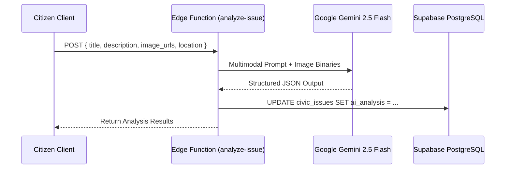

# CivicFix AI Architecture & Pipeline Specification

CivicFix integrates Google Gemini Models and specialized algorithms across 5 critical automated pipelines.

---

## 1. AI Infrastructure Overview

| Capability | Edge Function | Primary Model | Fallback Model | Trigger Point |
| :--- | :--- | :--- | :--- | :--- |
| **Multilingual Voice-to-Text** | `transcribe-voice` | `gemini-2.5-flash` | `gemini-1.5-flash` | Citizen voice recording |
| **Issue Analysis & Classification** | `analyze-issue` | `gemini-2.5-flash` | `gemini-1.5-flash` | Issue submission / update |
| **Duplicate Detection** | `detect-duplicates` | `gemini-2.5-flash` + PostGIS | Text matching heuristic | Post-analysis pipeline |
| **Complex Challenge Synthesis** | `generate-challenge` | `gemini-2.5-flash` | `gemini-1.5-flash` | Innovation Manager formulation |
| **8D Capability Matching** | `match-institutions` | Deterministic 8D Vector Score + Gemini Re-ranking | Rule-based scoring | Challenge publication |

---

## 2. Pipeline 1: Multilingual Voice Transcription (`transcribe-voice`)

### 2.1 Purpose
Converts citizen voice input in 10+ Indian and global languages into structured text and English translation.

### 2.2 Input Schema
```typescript
interface VoiceTranscriptionPayload {
  audio_base64: string;      // Base64 encoded audio (audio/webm, audio/mp4, audio/wav)
  mime_type: string;         // MIME format
  language_hint?: string;    // E.g., 'hi-IN', 'ta-IN', 'mr-IN', 'en-IN', 'auto'
}
```

### 2.3 System Prompt & Execution Logic
- Models invoked: `gemini-2.5-flash` with audio inline part.
- System prompt instructs Gemini to:
  1. Transcribe the audio verbatim in the spoken language and script.
  2. Detect spoken language name and ISO-639 code.
  3. Translate the transcribed message into standard English.
  4. Extract core civic keywords (e.g., `waterlogging`, `street light`, `pothole`).

### 2.4 Output Schema
```json
{
  "transcribed_text": "यहाँ पिछले 3 दिनों से पानी की पाइपलाइन टूटी हुई है...",
  "translated_text": "The water pipeline has been broken here for the past 3 days...",
  "detected_language": "Hindi",
  "language_code": "hi",
  "confidence_score": 0.96,
  "civic_keywords": ["water pipeline", "leakage", "water shortage"]
}
```

---

## 3. Pipeline 2: Issue Analysis & Classification (`analyze-issue`)

### 3.1 Purpose
Evaluates citizen issue reports, image evidence, and geographic context to predict severity, category, priority, and initial recommendation for `SIMPLE` vs `COMPLEX`.

### 3.2 Processing Flow


### 3.3 Prompt Invariants
- Enforces strict JSON Schema mode via `responseSchema` or structured system constraints.
- Analyzes both visual images (pothole depth, structural cracks, hazardous wiring) and textual description.
- Evaluates:
  - `urgency_score`: 1 to 10
  - `recommended_type`: `SIMPLE` (routine repair) vs `COMPLEX` (systemic failure requiring R&D)
  - `department_recommendation`: `ROADS`, `WATER_SUPPLY`, `ELECTRICITY`, `WASTE_MANAGEMENT`, `HEALTH_SANITATION`, `TRAFFIC_TRANSPORTATION`, `DRAINAGE`, `ENVIRONMENT`
  - `safety_hazard_detected`: Boolean
  - `estimated_sla_hours`: Suggested turnaround window

---

## 4. Pipeline 3: AI Spatial Duplicate Detection (`detect-duplicates`)

### 4.1 Purpose
Identifies near-duplicate issues reported by multiple citizens in the same geographic radius before dispatching teams.

### 4.2 Algorithm
1. **Spatial Filtering**: Queries `civic_issues` using PostGIS `ST_DWithin` for active issues within radius $R \le 100\text{ meters}$.
2. **Temporal Window**: Limits search to issues reported within the last 30 days.
3. **Semantic Similarity**: Sends current issue text and candidate nearby issues to Gemini to compute semantic overlap.
4. **Duplicate Grouping**: If similarity $\ge 0.82$, links issue to existing parent `root_issue_id` and registers citizen as an upvoter/subscriber instead of creating separate dispatch tickets.

---

## 5. Pipeline 4: Complex Challenge Synthesis (`generate-challenge`)

### 5.1 Purpose
Transforms an unorganized civic issue report with complex systemic failure patterns into a structured research & engineering challenge statement ready for academia and industry.

### 5.2 Structured Output Schema
```json
{
  "title": "Autonomous Acoustic Sensor Network for Urban Water Pipe Leak Localization",
  "challenge_summary": "Design and deploy low-cost acoustic and pressure sensors across municipal distribution networks...",
  "root_cause_analysis": "Aging cast-iron infrastructure subjected to high pressure transients and soil subsidence...",
  "research_domains": ["IOT_EMBEDDED_SYSTEMS", "ACOUSTIC_SIGNAL_PROCESSING", "HYDROLOGY"],
  "technical_requirements": [
    "Sub-meter leak localization accuracy",
    "Minimum 5-year battery autonomy",
    "LoRaWAN / NB-IoT telemetry transmission"
  ],
  "expected_deliverables": [
    "Hardware prototype sensor nodes (x10)",
    "Cloud data ingestion & localization backend",
    "30-day field validation pilot in Ward 12"
  ],
  "evaluation_criteria": [
    { "criterion": "Localization Precision", "weight": 0.35 },
    { "criterion": "Unit Cost & Scalability", "weight": 0.35 },
    { "criterion": "Deployment Feasibility", "weight": 0.30 }
  ],
  "budget_range_recommended": {
    "min_inr": 800000,
    "max_inr": 2500000
  },
  "estimated_duration_months": 6
}
```

---

## 6. Pipeline 5: 8-Dimension University Capability Matching (`match-institutions`)

### 6.1 Purpose
Identifies the top matching universities and research institutions from a verified database of 105 Indian institutions across 8 weighted dimensional vectors.

### 6.2 The 8 Dimensions
1. **Domain Expertise Match ($W_1 = 0.25$)**: Direct alignment of institution departments and research centers with challenge domains.
2. **NIRF / Research Rank ($W_2 = 0.15$)**: National institutional ranking and research quality score.
3. **Laboratory & Equipment Infrastructure ($W_3 = 0.15$)**: Availability of certified testing testbeds, supercomputing facilities, and specialized fabrication labs.
4. **Faculty Publications & Patents ($W_4 = 0.15$)**: High-impact citations and registered patents in related technological subdomains.
5. **Geographic Proximity ($W_5 = 0.10$)**: Distance from municipal testbed site for field experimentation.
6. **Past Civic Project Track Record ($W_6 = 0.10$)**: Historical success rate on previous CivicFix / municipal innovation challenges.
7. **Cross-Disciplinary Team Readiness ($W_7 = 0.05$)**: Availability of cross-departmental faculties (e.g., Computer Science + Civil Engineering).
8. **Testbed / Field Deployment Capability ($W_8 = 0.05$)**: Dedicated field engineering teams and pilot management infrastructure.

### 6.3 Formula
$$\text{Score} = \sum_{i=1}^{8} (w_i \times s_i)$$

Scores range from $0.0$ to $100.0\%$. Institutions scoring $\ge 65.0\%$ receive automated outreach recommendations.

---

## 7. Resilience, Fallbacks, and Error Handling

1. **API Key Fallback**: The Edge Functions read `GEMINI_API_KEY` from Supabase secrets.
2. **Model Cascading**: If `gemini-2.5-flash` returns HTTP 429 (Rate Limit) or 503 (Overloaded), functions automatically cascade to `gemini-1.5-flash`.
3. **Deterministic Fallbacks**: If all Gemini endpoints fail:
   - Voice transcription returns an explicit error prompting citizen to type manually.
   - Issue analysis defaults to `URGENCY = 5`, `TYPE = SIMPLE`, and tags issue for manual Admin review.
   - Institution matching falls back to keyword intersection against department names.
