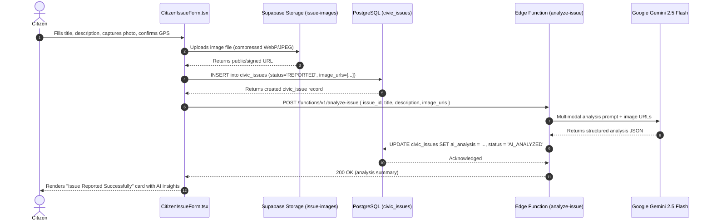
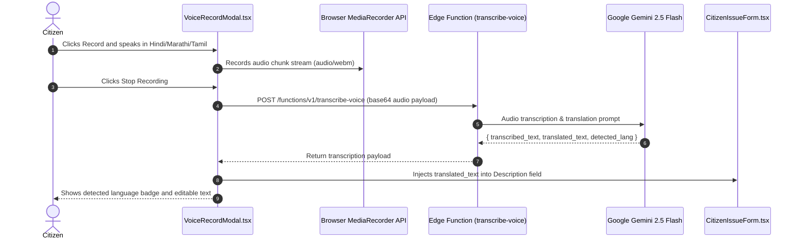

# CivicFix Data Flows & Execution Traces

This document details 21 end-to-end data flows across all persona modules in CivicFix, tracing actions across Frontend Components, API/Edge Functions, PostgreSQL, Storage Buckets, AI Engines, and UI updates.

---

## 1. Flow 1: Citizen Issue Reporting with Multimodal AI & GPS

---

## 2. Flow 2: Multilingual Voice Input to Form Text

---

## 3. Flow 3: Admin Complex Problem Governance & Triage Override

1. **Frontend**: Admin navigates to `/app/innovation/problems` or `/app/admin/issues`.
2. **Auth & Role Check**: `RequireRole(["ADMIN"])` verifies token via Clerk & user profile.
3. **Action**: Admin clicks "Classify as Complex Problem" on an incoming civic issue.
4. **Database Mutation**: `UPDATE civic_issues SET final_issue_type = 'COMPLEX', status = 'CLASSIFIED' WHERE id = :id`.
5. **Database Trigger**: `enforce_issue_classification_authority()` executes `BEFORE UPDATE`, verifying `auth.uid()` matches role `ADMIN`.
6. **Notification Trigger**: `trg_notify_complex_issue_classified()` inserts notification into `notifications` table for `INNOVATION_MANAGER` users.
7. **UI Update**: Issue badge transitions to `COMPLEX`, and item appears in the Innovation Manager's Problem Formulation queue.

---

## 4. Flow 4: Innovation Manager Challenge Formulation

1. **Frontend**: Innovation Manager opens `/app/innovation/problems/:problemId`.
2. **AI Synthesis**: User clicks "Formulate Challenge via Gemini AI".
3. **Edge Function**: `generate-challenge` called with issue title, description, community impact notes, and images.
4. **AI Generation**: Gemini 2.5 Flash returns challenge statement, root cause breakdown, required research domains, and budget parameters.
5. **State Guard**: Form verifies that all fields (title, summary, domains, deliverables) are non-null strings.
6. **DB Mutation**: `INSERT into innovation_challenges` with `status = 'DRAFT'`.
7. **UI Update**: Renders Challenge Editor with populated fields, editable by Innovation Manager before publication.

---

## 5. Flow 5: 8-Dimension University Capability Matching

1. **Trigger**: Innovation Manager publishes challenge or clicks "Run University Match".
2. **Edge Function**: `POST /functions/v1/match-institutions { challenge_id }`.
3. **DB Read**: Fetches challenge required domains and all active records from `universities` (105 institutions).
4. **Algorithm**: Computes normalized weighted sum across 8 dimensions (Domain Match, NIRF rank, Labs, Publications, Proximity, Track record, Team readiness, Testbed capability).
5. **DB Insertion**: Inserts top-ranked results into `institution_matches` with `match_score` and `dimension_breakdown` JSON.
6. **UI Update**: Innovation Manager views ranked match list with score breakdown gauges and "Invite" action buttons.

---

## 6. Flow 6: Institutional Outreach & Challenge Invitation

1. **Frontend**: Innovation Manager selects target universities and clicks "Dispatch Outreach Invitations".
2. **DB Mutation**: `INSERT into challenge_invitations (challenge_id, university_id, status='PENDING', expires_at=NOW()+30d)`.
3. **Notification**: Dispatches in-app notification and email alert to the University Representative.
4. **University View**: Representative logs into `/app/university/invitations`, views challenge details and NIRF alignment, and clicks "Accept Challenge".
5. **DB Mutation**: `UPDATE challenge_invitations SET status='ACCEPTED'`.
6. **Permission Unlock**: RLS policies grant the university read/write access to draft proposals under this challenge.

---

## 7. Flow 7: University 11-Section Proposal Submission

1. **Frontend**: University Team fills 11 required structural sections in `/app/university/proposals/new`.
2. **Local Validation**: Form ensures word counts and budget line items meet minimum requirements.
3. **DB Mutation**: `INSERT into research_proposals (..., status='SUBMITTED')`.
4. **Database Trigger**: `enforce_proposal_section_completeness()` validates all 11 JSON keys are populated and non-empty.
5. **Tamper Locking Trigger**: Proposal status set to `SUBMITTED`; RLS locks the row against subsequent institution updates.
6. **Notification**: Innovation Manager receives review request alert.

---

## 8. Flow 8: Innovation Project Commissioning & Team Management

1. **Frontend**: Innovation Manager reviews and marks proposal `APPROVED`.
2. **Project Creation**: Innovation Manager provisions project record in `innovation_projects` (`status='ACTIVE'`).
3. **Team Allocation**: University PI navigates to Project Team tab and adds faculty, researchers, and students.
4. **DB Mutation**: Inserts records into `research_team_members` (supports non-auth academic profiles with ORCID/designation).
5. **UI Update**: Live member roster displays across both University Workspace and Innovation Manager Control Center.

---

## 9. Flow 9: Testbed Pilot Deployment & Live Telemetry Ingestion

1. **Pilot Application**: University applies for city testbed deployment at specified GPS coordinates.
2. **Approval**: City Municipal Officer and Innovation Manager grant permit (`status='SITE_APPROVED'`).
3. **Hardware Deployment**: Sensors / intervention hardware deployed on site.
4. **Telemetry Ingestion**: IoT gateways / manual observers push telemetry metrics into `pilot_telemetry` table.
5. **UI Visualization**: Real-time charts display temperature differentials, water pressure stabilization, and civic impact metrics.

---

## 10. Flow 10: Validation Panel Sign-off & Knowledge Base Archival

1. **Evaluation**: Independent Validation Panel assesses final testbed metrics against baseline.
2. **Sign-off**: Panel marks pilot `SUCCESSFUL`.
3. **Project Completion**: Innovation Manager transitions `innovation_projects` status to `COMPLETED`.
4. **Knowledge Base Export**: System packages technical architecture, CAD drawings, pilot data, and operational guidelines into `solution_catalog` for citywide replication.

---

## 11. Flow 11: Municipal Officer Routine Triage & Department Routing

1. **Dashboard**: Municipal Officer reviews incoming `SIMPLE` classified issues in `/app/officer/triage`.
2. **Urgency Assignment**: Officer adjusts priority (`LOW`, `MEDIUM`, `HIGH`, `CRITICAL`) and SLA target.
3. **Routing**: Assigns issue to specific municipal department (e.g., `ROADS`, `DRAINAGE`).
4. **DB Mutation**: `UPDATE civic_issues SET status='TRIAGED', department_id=:deptId, priority=:priority`.
5. **UI Update**: Issue moves from Officer Triage to Department Manager Dispatch Queue.

---

## 12. Flow 12: Department Manager Field Worker Dispatch

1. **Queue**: Department Manager opens `/app/department/dispatch`.
2. **Assignment**: Selects available Field Worker / Crew Leader based on current workload.
3. **DB Mutation**: `UPDATE civic_issues SET status='DISPATCHED', assigned_worker_id=:workerId`.
4. **Worker Notification**: Push notification dispatched to assigned Field Worker's device.

---

## 13. Flow 13: Field Worker Task Execution & Resolution Proof

1. **Worker App**: Field Worker views assigned task on mobile `/app/worker/tasks`.
2. **Commence**: Clicks "Start Work" (`status='IN_PROGRESS'`).
3. **Resolution**: After physical repair, captures completion photo and enters repair notes and material costs.
4. **Upload**: Image uploaded to Supabase Storage `resolution-images` bucket.
5. **DB Mutation**: `UPDATE civic_issues SET status='WORK_SUBMITTED', resolution_images=[...], resolution_notes=:notes`.

---

## 14. Flow 14: Department Manager Resolution QA & Rework Handling

1. **Review**: Manager inspects before/after photos and worker notes.
2. **Branch A (Approve)**: Manager signs off $\rightarrow$ `UPDATE civic_issues SET status='RESOLVED'`.
3. **Branch B (Rework)**: Manager finds defective repair $\rightarrow$ Enters rework instructions $\rightarrow$ `UPDATE civic_issues SET status='REWORK_REQUESTED'`. Issue reappears in Field Worker's active queue with rework banner.

---

## 15. Flow 15: Citizen Resolution Verification & Feedback Loop

1. **Citizen Notification**: Citizen receives alert "Your reported issue has been resolved".
2. **Verification UI**: Citizen views resolution photos on `/app/citizen/issues/:id`.
3. **Branch A (Verify)**: Citizen clicks "Confirm Fix" $\rightarrow$ Sets `status='VERIFIED'`, submits 1–5 star rating and feedback comment.
4. **Branch B (Dispute)**: Citizen clicks "Issue Not Fixed" $\rightarrow$ Sets `status='REOPENED'`, re-enters triage queue with high priority flag.

---

## 16. Flow 16: Industry Partner Marketplace Procurement

1. **Marketplace**: Industry Partner browses `/app/partner/marketplace` for active challenge procurement needs.
2. **Offer Submission**: Partner submits hardware supply or co-development bid for an active university project.
3. **DB Mutation**: Inserts record into `partner_marketplace_offers`.
4. **Approval**: University PI and Innovation Manager review and accept commercial partnership offer.

---

## 17. Flow 17: User Authentication & Role Bootstrap

1. **Auth Handshake**: User logs in via Clerk Auth provider.
2. **JWT Sync**: Supabase client intercepts Clerk session token and verifies claims.
3. **Profile Lookup**: Frontend queries `users` table where `clerk_id = auth.jwt()->>'sub'`.
4. **Role Routing**: User is redirected to their designated role dashboard (`/app/citizen`, `/app/admin`, `/app/officer`, etc.) based on `role_code`.

---

## 18. Flow 18: Admin User Management & Role Assignment

1. **User Roster**: Admin opens `/app/admin/users`.
2. **Create User**: Admin fills user profile, email, and assigns `role_code`.
3. **Edge Function**: Invokes `admin-create-user` (service role) to create Clerk user and Supabase `users` row transactionally.
4. **Audit Log**: Action recorded in `audit_logs`.

---

## 19. Flow 19: Notification Dispatch & Real-Time Delivery

1. **Trigger Event**: Any workflow status change (triage, dispatch, approval, revision).
2. **DB Trigger**: PostgreSQL trigger executes `INSERT INTO notifications (user_id, title, message, link, type)`.
3. **Real-time Channel**: Supabase Realtime emits `postgres_changes` event on `notifications` channel.
4. **UI Update**: Client `NotificationBell` badge counter increments instantly without page reload.

---

## 20. Flow 20: Municipal Analytics Aggregation & Heatmaps

1. **Analytics Engine**: Municipal Officer opens `/app/officer/analytics`.
2. **Spatial Aggregation**: Executes PostGIS query clustering issues by ward, department, and resolution duration.
3. **Visualization**: Renders GIS heatmap overlay, SLA compliance charts, and monthly resolution efficiency graphs.

---

## 21. Flow 21: Audit Logging & System Governance

1. **Event Capture**: Critical mutations (role changes, complex overrides, budget disbursements, proposal approvals).
2. **Immutable Log**: `audit_logs` record created with timestamp, actor `user_id`, target `entity_type`, `action`, and JSON diff.
3. **RLS Guard**: Table is write-only via triggers/functions; read-only for `ADMIN`; zero delete/update permissions for all users.
