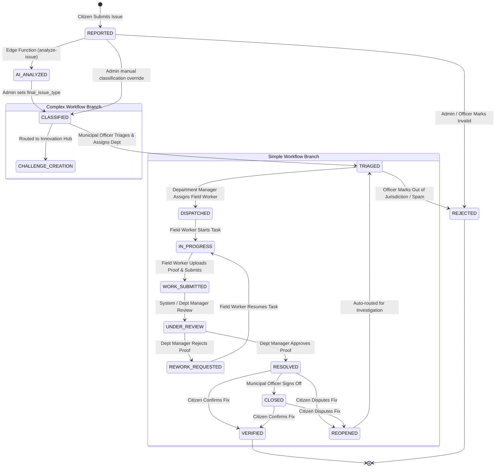
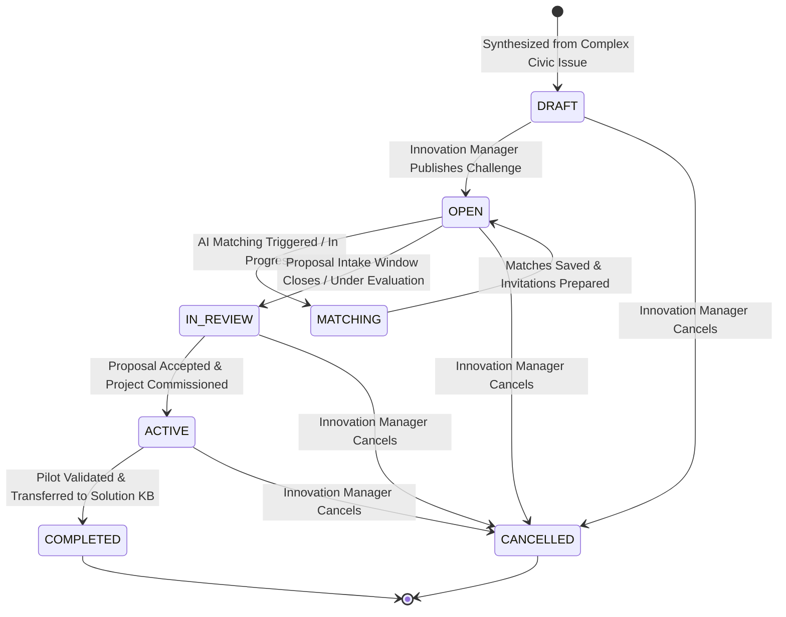
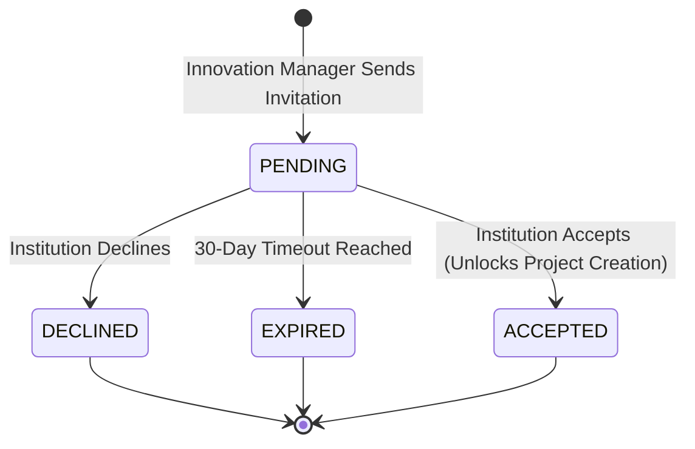
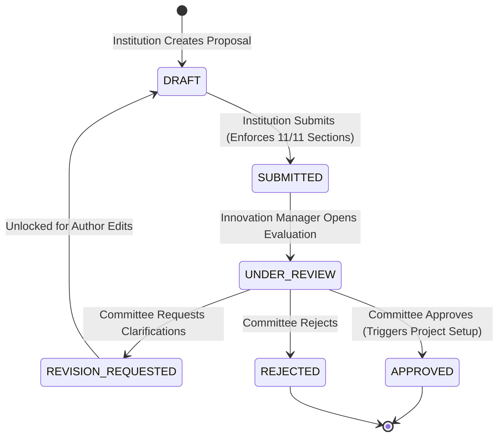
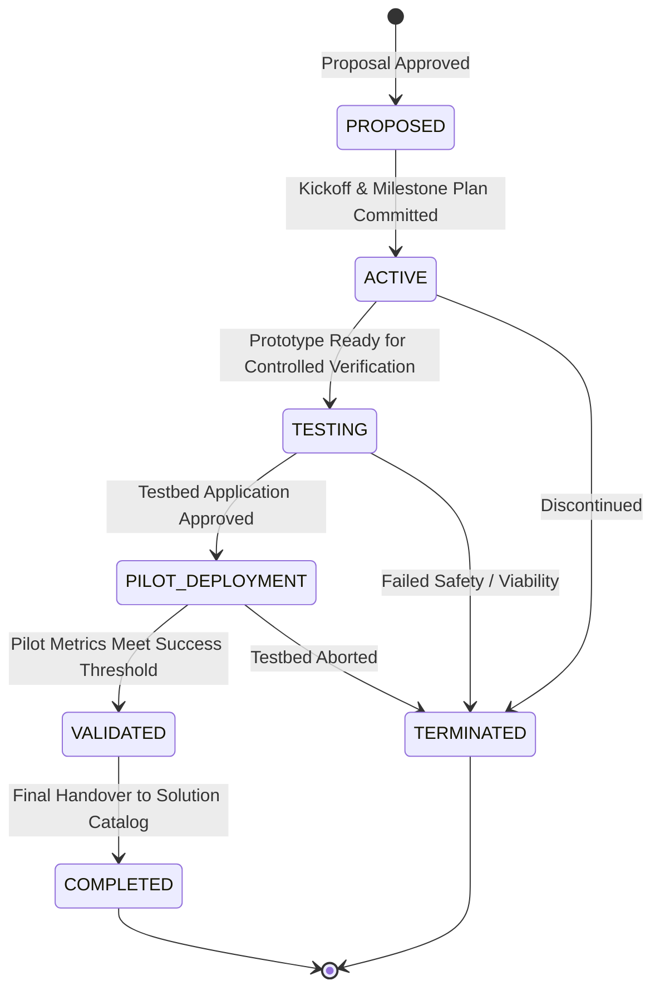
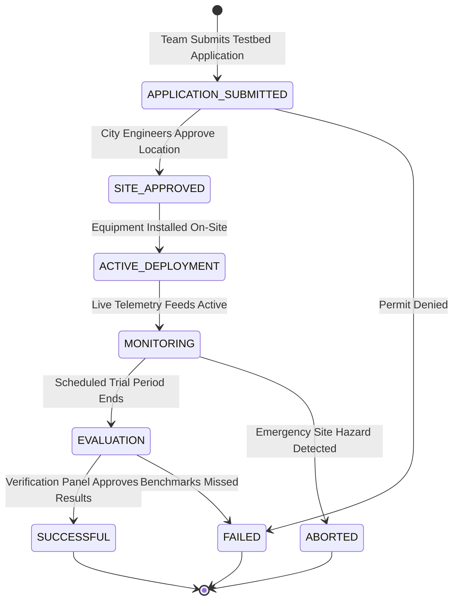

# CivicFix State Machines Specification

This document defines every state machine in the CivicFix platform, detailing states, valid transitions, triggering actors, validation rules, automated side-effects, and terminal conditions.

---

## 1. Civic Issue Lifecycle State Machine

The core entity `civic_issues` tracks municipal complaints from submission to permanent resolution.

### 1.1 State Definitions
- `REPORTED`: Issue created by Citizen. AI analysis runs asynchronously. Awaiting Admin classification.
- `AI_ANALYZED`: AI classification and duplicate detection completed. Ready for Admin classification.
- `CLASSIFIED`: Admin has classified the issue as `SIMPLE` or `COMPLEX`.
- `TRIAGED`: Municipal Officer has assigned urgency, priority, and routed the issue to a Department.
- `DISPATCHED`: Department Manager has assigned the issue to a Field Worker team.
- `IN_PROGRESS`: Field Worker has acknowledged assignment and commenced on-site work.
- `WORK_SUBMITTED`: Field Worker has uploaded resolution photos, notes, and marked on-site repair complete.
- `UNDER_REVIEW`: Department Manager is reviewing field resolution evidence and cost notes.
- `REWORK_REQUESTED`: Department Manager rejected field work and routed it back to Field Worker with corrective instructions.
- `RESOLVED`: Department Manager approved field work and signed off. Awaiting Municipal Officer closure or Citizen verification.
- `CLOSED`: Municipal Officer confirmed final resolution sign-off.
- `VERIFIED`: Citizen confirmed satisfaction with resolution proof via Citizen Dashboard. (Terminal)
- `REOPENED`: Citizen disputed resolution within verification window. Sent back to `TRIAGED` for investigation.
- `REJECTED`: Municipal Officer / Admin marked issue as invalid, duplicate, spam, or out-of-jurisdiction. (Terminal)

### 1.2 State Transition Matrix

### 1.3 Transition Rules & Guards
1. **Classification Guard**: Only users with role `ADMIN` can transition an issue to `CLASSIFIED` (enforced by DB trigger `enforce_issue_classification_authority()`).
2. **Reopening Rule**: Citizens can only transition from `RESOLVED` or `CLOSED` to `REOPENED` within 7 days of resolution.
3. **Evidence Requirement**: Transition to `WORK_SUBMITTED` strictly requires at least 1 image URL in `resolution_images`.

---

## 2. Innovation Challenge State Machine

Complex problems transition from `civic_issues` (`final_issue_type = 'COMPLEX'`) into `innovation_challenges`.

### 2.1 State Definitions
- `DRAFT`: AI synthesized draft or initial creation by Innovation Manager. Invisible to universities.
- `OPEN`: Published by Innovation Manager. Open for institutional matching, outreach, and proposal intake.
- `MATCHING`: AI 8-dimension capability algorithm is running against the university registry.
- `IN_REVIEW`: Proposals have been received and are undergoing multi-stakeholder evaluation.
- `ACTIVE`: Proposals approved, projects active, and solutions under R&D.
- `COMPLETED`: Pilot testing verified, validation panel signed off, and final handover completed. (Terminal)
- `CANCELLED`: Challenge cancelled due to policy change, budget revocation, or upstream issue resolution. (Terminal)

### 2.2 State Transition Matrix

---

## 3. Institution Outreach & Invitation State Machine

Entity: `challenge_invitations`

### 3.1 State Definitions
- `PENDING`: Invitation dispatched to University Representative / Department Dean.
- `ACCEPTED`: Institution accepted participation and unlocked the Challenge Workspace to create Proposals.
- `DECLINED`: Institution declined participation (with reason).
- `EXPIRED`: Response window expired without institutional action.

### 3.2 State Transition Matrix

---

## 4. Research & Pilot Proposal State Machine

Entity: `research_proposals`

### 4.1 State Definitions
- `DRAFT`: University PI / Team actively drafting 11 required structural sections.
- `SUBMITTED`: Proposal submitted for formal review. Schema validated and payload snapshot locked.
- `UNDER_REVIEW`: Innovation Manager and Technical Committee actively evaluating proposal.
- `REVISION_REQUESTED`: Reviewers requested revisions to specific methodology, budget, or safety sections.
- `APPROVED`: Proposal officially approved with allocated budget and resource clearances.
- `REJECTED`: Proposal rejected after committee review. (Terminal)

### 4.2 State Transition Matrix

### 4.3 Validation Guard
- Transition to `SUBMITTED` is guarded by PostgreSQL trigger `enforce_proposal_section_completeness()`, requiring:
  1. `problem_understanding`
  2. `proposed_solution`
  3. `technical_approach`
  4. `innovation_novelty`
  5. `deliverables`
  6. `timeline_phases`
  7. `budget_breakdown`
  8. `team_structure`
  9. `equipment_infrastructure`
  10. `risk_mitigation`
  11. `impact_metrics`

---

## 5. Innovation R&D Project State Machine

Entity: `innovation_projects`

### 5.1 State Definitions
- `PROPOSED`: Created upon proposal acceptance, awaiting kickoff and milestone definition.
- `ACTIVE`: R&D team active, milestones tracked, prototype engineering underway.
- `TESTING`: Prototype deployed in controlled lab / sandbox environment.
- `PILOT_DEPLOYMENT`: Real-world urban testbed deployment active with telemetry tracking.
- `VALIDATED`: Testbed pilot completed and passed Validation Panel criteria.
- `COMPLETED`: Project finished, final report accepted, knowledge base article published. (Terminal)
- `TERMINATED`: Project halted early due to safety failure, breach of contract, or insurmountable roadblock. (Terminal)

### 5.2 State Transition Matrix

---

## 6. Testbed Pilot Execution State Machine

Entity: `pilot_deployments`

### 6.1 State Definitions
- `APPLICATION_SUBMITTED`: Institution requested city site / permit access for field test.
- `SITE_APPROVED`: City Municipal Officers and Innovation Manager approved location and safety plan.
- `ACTIVE_DEPLOYMENT`: Hardware / sensors / interventions physically deployed in urban zone.
- `MONITORING`: Continuous telemetry ingestion, incident logs, and metric collection.
- `EVALUATION`: Field trial completed, validation panel reviewing performance dataset.
- `SUCCESSFUL`: Pilot met target efficiency / thermal / civic benchmarks. (Terminal)
- `FAILED`: Pilot failed critical benchmarks, safety thresholds, or community acceptance. (Terminal)
- `ABORTED`: Pilot halted prematurely due to safety hazard or civic disruption. (Terminal)

### 6.2 State Transition Matrix

